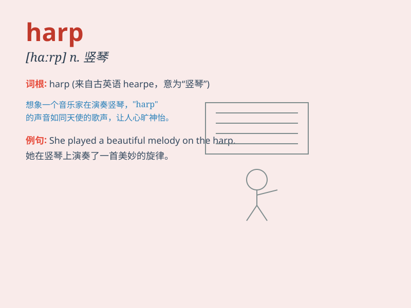

## harp

**英音:** _[hɑːp]_ **美音:** _[hɑrp]_

**译义:** *n.竖琴vi.弹奏竖琴,不停地说,喋喋不休*

### 短语

+ **harp on:** _反复唠叨；不停诉苦_

+ **harp string:** _竖琴弦_

+ **celtic harp:** _凯尔特竖琴_

+ **harp music:** _竖琴音乐_

+ **harp player:** _竖琴演奏者_

### 例句

#### 例句1

> **She played the harp beautifully at the concert.**

**中文翻译:** 她在音乐会上弹奏了优美的竖琴。

**单词释义:** 竖琴

#### 例句2

> **He always harps on about his past achievements.**

**中文翻译:** 他总是喋喋不休地谈论他过去的成就。

**单词释义:** 喋喋不休地谈论

#### 例句3

> **Don\'t harp on the same issue over and over again.**

**中文翻译:** 不要一遍又一遍地谈论同一个问题。

**单词释义:** 唠叨

### 背诵小故事

> A prince was lost in a forest. He found an old hut with a beautiful
harp inside. When he touched the harp, it played a magical melody that
led him back home. The harp became his lucky charm.

**一位王子在森林里迷路了。他发现一间旧茅屋，里面有一把漂亮的竖琴。当他触摸竖琴时，它奏出了神奇的旋律，引领他回家。这把竖琴成了他的幸运符。**

### 图义

