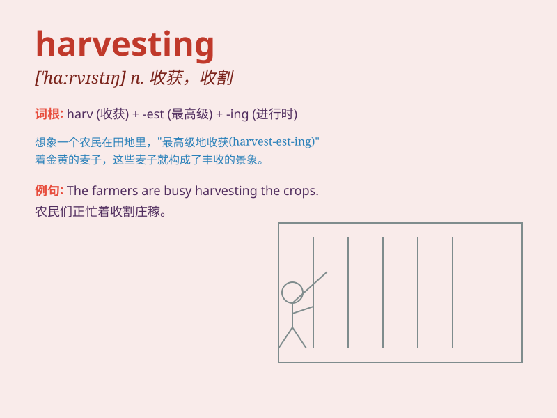

## harvesting

**英音:** _[\'hɑːvɪstɪŋ]_ **美音:** _[\'hɑrvɪst]_

**译义:** *v.收获n.收获*

### 短语

+ **crop harvesting:** _农作物收获_

+ **harvesting season:** _收获季节_

+ **harvesting machine:** _收割机_

+ **fruit harvesting:** _水果采摘_

+ **timely harvesting:** _及时收获_

### 例句

#### 例句1

> **The farmers are busy with the harvesting of wheat.**

**中文翻译:** 农民们正在忙着收割小麦。

**单词释义:** 收割（庄稼）

#### 例句2

> **Harvesting fruits is a labor-intensive task.**

**中文翻译:** 收获水果是一项劳动密集型任务。

**单词释义:** 采摘（水果）

#### 例句3

> **The company is involved in the harvesting of solar energy.**

**中文翻译:** 该公司涉足太阳能采集。

**单词释义:** 收集（能源等）

### 背诵小故事

> One autumn, the farmers were busy harvesting the ripe crops. They
worked from dawn to dusk, happily gathering the fruits of their hard
work. The scene of harvesting was full of joy and hope.

**一个秋天，农民们忙着收割成熟的庄稼。他们从黎明工作到黄昏，开心地收集着辛勤劳作的成果。收割的场景充满了喜悦和希望。**

### 图义

