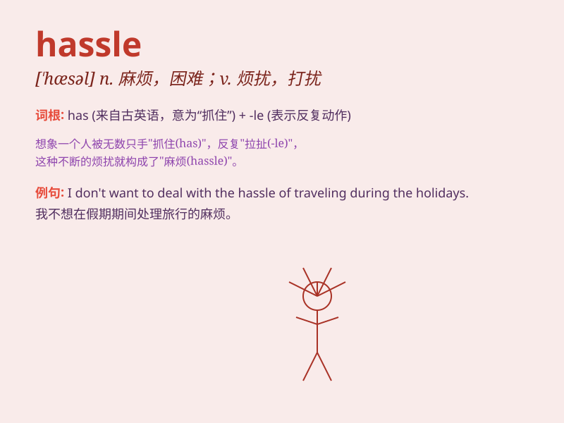

## hassle

**英音:** _[\'hæs(ə)l]_ **美音:** _[\'hæsl]_

**译义:** *n.激战vi.争论vt.与\...争辩*

### 短语

+ **hassle free:** _没有麻烦的；轻松的_

+ **give someone a hassle:** _给某人找麻烦；使某人烦恼_

+ **hassle over:** _为\...\...争论不休；为\...\...烦恼_

+ **constant hassle:** _不断的麻烦；持续的困扰_

+ **avoid hassle:** _避免麻烦_

### 例句

#### 例句1

> **I don\'t want the hassle of moving house again.**

**中文翻译:** 我不想再经历搬家的麻烦了。

**单词释义:** 麻烦；困难

#### 例句2

> **It\'s such a hassle to get a visa.**

**中文翻译:** 办签证真是太麻烦了。

**单词释义:** 麻烦；烦心事

#### 例句3

> **She doesn\'t need the hassle of looking after small children.**

**中文翻译:** 她不需要照顾小孩的麻烦。

**单词释义:** 麻烦；烦恼

### 背诵小故事

> One day, Tom was late for work. When he got to the office, he found
his computer was not working. Fixing it was such a hassle. He had to
call the IT guy and wait for a long time.

**一天，汤姆上班迟到了。当他到办公室时，发现他的电脑坏了。修理它真是件麻烦事。他不得不打电话给
IT 人员，然后等了很久。**

### 图义

