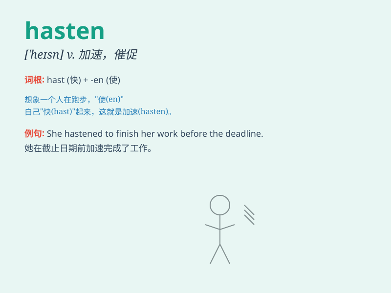

## hasten

**英音:** _[\'heɪs(ə)n]_ **美音:** _[\'hesn]_

**译义:** *v.催促,赶紧,促进,加速*

### 短语

+ **hasten to do sth:** _急忙做某事_

+ **hasten away:** _匆匆离去_

+ **hasten off:** _急忙离开_

+ **hasten forward:** _赶快向前_

+ **hasten the process:** _加快进程_

### 例句

#### 例句1

> **She hastened to explain the situation.**

**中文翻译:** 她连忙解释了情况。

**单词释义:** 急忙，赶快

#### 例句2

> **The doctor was hastened to the emergency room.**

**中文翻译:** 医生被紧急送往急诊室。

**单词释义:** 使赶紧，催促

#### 例句3

> **His actions only hastened the problem.**

**中文翻译:** 他的行为只会加剧问题的严重性。

**单词释义:** 加速，加快

### 背诵小故事

> A little rabbit was lost in the forest. It needed to hasten back home
before dark. So it ran as fast as it could. Finally, it reached home
safely. The word \'hasten\' means to move or do something quickly.

**一只小兔子在森林里迷路了。它需要在天黑前赶快回家。所以它尽可能快地跑。最后，它安全到家了。单词\'hasten\'意思是赶快，急忙**

### 图义

