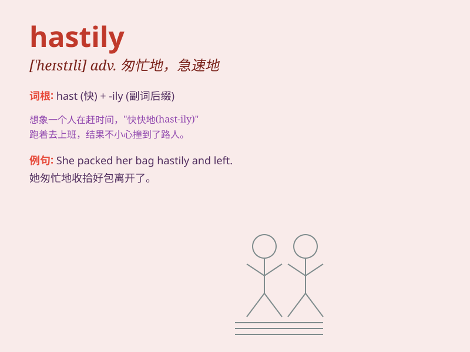

## hastily

**英音:** _[\'heɪstɪlɪ]_ **美音:** _[\'hestɪli]_

**译义:** *adv.急速地,轻率地,慌忙地,草率地*

### 短语

+ **act hastily:** _仓促行事_

+ **speak hastily:** _匆忙说话_

+ **decide hastily:** _匆忙决定_

+ **write hastily:** _匆忙书写_

+ **leave hastily:** _匆忙离开_

### 例句

#### 例句1

> **She hastily packed her bags and left for the airport.**

**中文翻译:** 她赶紧收拾好行李，前往机场。

**单词释义:** 匆忙地

#### 例句2

> **He hastily wrote down the phone number before he forgot it.**

**中文翻译:** 他赶紧记下电话号码，以免忘记。

**单词释义:** 匆忙地

#### 例句3

> **The workers hastily completed the project to meet the
deadline.**

**中文翻译:** 工人们匆匆忙忙地在最后期限前完成了这个项目。

**单词释义:** 匆忙地

### 背诵小故事

> One day, Tom was late for school. He got dressed hastily, didn\'t
even tie his shoes properly, and ran out of the house. When he arrived
at school, he was still out of breath.

**有一天，汤姆上学迟到了。他匆忙地穿好衣服，甚至鞋子都没系好，就跑出了家门。当他到达学校时，仍然气喘吁吁。**

### 图义

