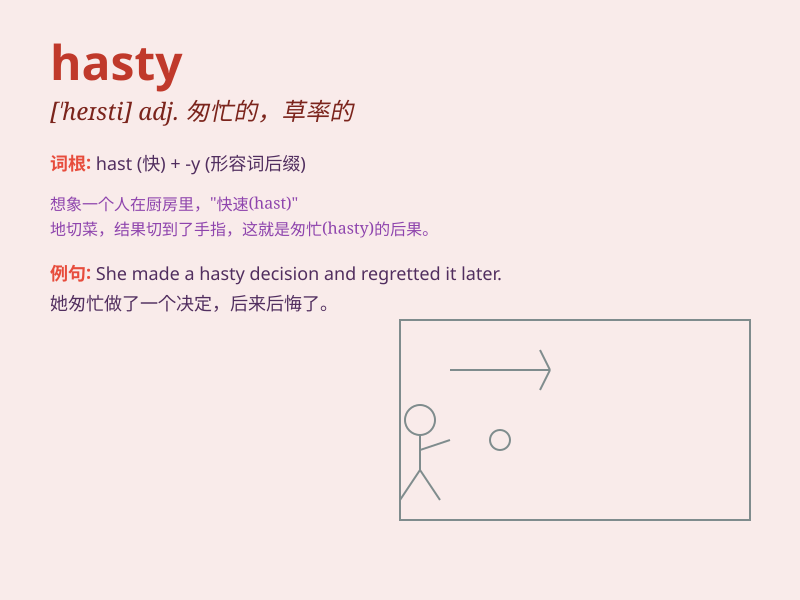

## hasty

**英音:** _[\'heɪstɪ]_ **美音:** _[\'hesti]_

**译义:** *adj.匆忙的,草率的*

### 短语

+ **hasty decision:** _仓促的决定_

+ **hasty departure:** _匆忙的离开_

+ **hasty conclusion:** _草率的结论_

+ **hasty generalization:** _草率的归纳_

+ **hasty meal:** _匆忙的一餐_

### 例句

#### 例句1

> **He made a hasty decision without thinking it through.**

**中文翻译:** 他没有经过深思熟虑，就做出了仓促的决定。

**单词释义:** 仓促的；匆忙的

#### 例句2

> **The hasty departure left many things unfinished.**

**中文翻译:** 仓促的离开留下了许多未完成的事情。

**单词释义:** 匆忙的；仓促的

#### 例句3

> **Don\'t be so hasty in judging others.**

**中文翻译:** 不要那么草率地评判别人。

**单词释义:** 仓促的；轻率的

### 背诵小故事

> A hare was always hasty. One day, in a race with a turtle, it rushed
too fast and got tired. Due to its hasty pace, it lost and learned a
lesson.

**一只野兔总是很匆忙。有一天，在和乌龟的赛跑中，它跑得太快而累了。由于它匆忙的步伐，它输了并且得到了教训。**

### 图义

