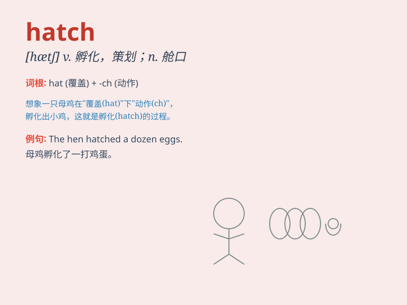

## hatch

**英音:** _[hætʃ]_ **美音:** _[hætʃ]_

**译义:**
*n.孵化,舱口,舱口盖,(门、墙壁、地板上的)开口vt.孵,孵出,策划,图谋vi.孵化*

### 短语

+ **hatch out:** _孵出；破壳而出_

+ **hatch plan:** _策划；谋划_

+ **hatch egg:** _孵蛋_

+ **hatch conspiracy:** _密谋；策划阴谋_

+ **hatch escape:** _策划逃跑_

### 例句

#### 例句1

> **The chicken hatched from the egg.**

**中文翻译:** 小鸡是从蛋里孵出来的。

**单词释义:** 孵化

#### 例句2

> **They hatched a plan to escape.**

**中文翻译:** 他们制定了逃跑计划。

**单词释义:** 策划

#### 例句3

> **The mystery was hatched in the old castle.**

**中文翻译:** 谜团就在这座古老的城堡中酝酿。

**单词释义:** 产生

### 背诵小故事

> A hen sat on the eggs in the nest to hatch them. After days of
waiting, the chicks finally broke through the shells. The process of new
life emerging is what \'hatch\' means.

**一只母鸡坐在窝里孵蛋。经过数日的等待，小鸡终于破壳而出。新生命诞生的这个过程就是'hatch'的意思。**

### 图义

