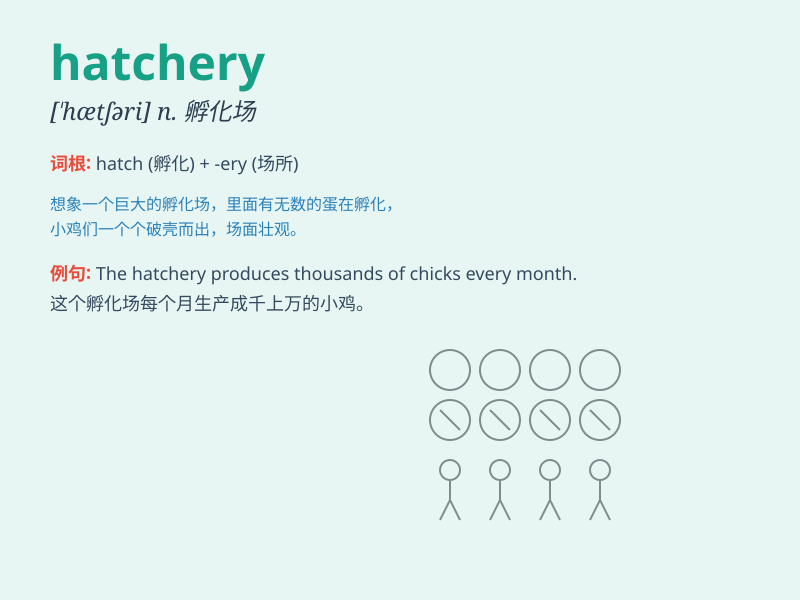

## hatchery

**英音:** _[\'hætʃərɪ]_ **美音:** _[\'hætʃəri]_

**译义:** *n.孵卵所*

### 短语

+ **fish hatchery:** _鱼苗场_

+ **poultry hatchery:** _家禽孵化场_

+ **hatchery egg:** _孵化用蛋_

+ **commercial hatchery:** _商业孵化场_

+ **hatchery manager:** _孵化场经理_

### 例句

#### 例句1

> **The hatchery produces thousands of fish fry every year.**

**中文翻译:** 该孵化场每年生产数千尾鱼苗。

**单词释义:** 孵化场

#### 例句2

> **The chicken hatchery was filled with the cheeping of newly
hatched chicks.**

**中文翻译:** 小鸡孵化场里充满了刚出壳的小鸡的叽叽喳喳声。

**单词释义:** 孵化场

#### 例句3

> **We visited a turtle hatchery to learn about their conservation
efforts.**

**中文翻译:** 我们参观了海龟孵化场，了解他们的保护工作。

**单词释义:** 孵化场

### 背诵小故事

> There was a small town with a hatchery. One day, a little girl
visited and saw eggs hatching into cute chicks. She was so excited and
understood that the hatchery was the place where new life began.

**有一个小镇有一家孵卵所。有一天，一个小女孩去参观，看到鸡蛋孵出了可爱的小鸡。她非常兴奋，明白了孵卵所是新生命开始的地方。**

### 图义

