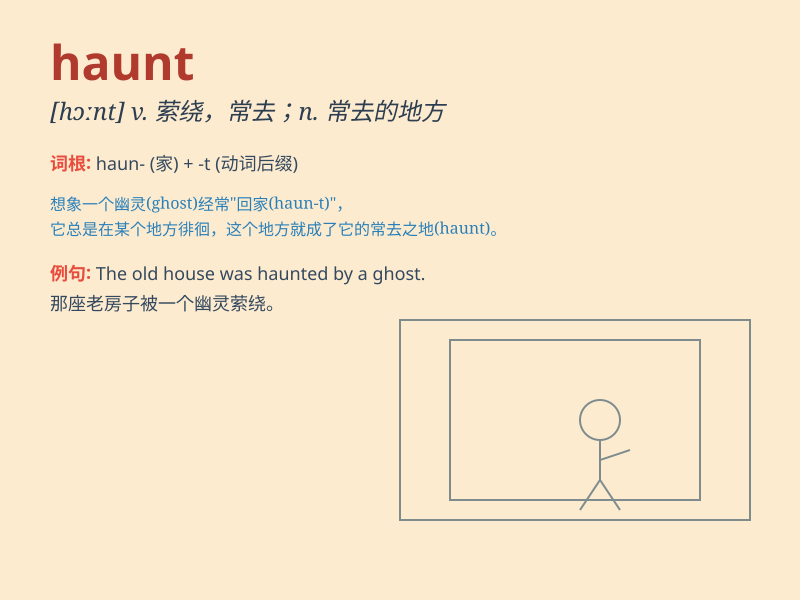

## haunt

**英音:** _[hɔːnt]_ **美音:** _[hɔnt]_

**译义:** *v.神鬼出没*

### 短语

+ **haunt about:** _经常出没于；在\...\...附近徘徊_

+ **haunt of:** _\...\...常去的地方_

+ **haunt by:** _被\...\...困扰；萦绕心头_

+ **haunt with:** _经常浮现出；常被\...\...缠住_

+ **haunted house:** _鬼屋；闹鬼的房子_

### 例句

#### 例句1

> **The old house is haunted by ghosts.**

**中文翻译:** 老房子里经常有鬼魂出没。

**单词释义:** （被）萦绕；（鬼魂等）常出没于

#### 例句2

> **Memories of her childhood haunt her.**

**中文翻译:** 童年的回忆萦绕在她心头。

**单词释义:** （想法、回忆等）萦绕心头

#### 例句3

> **He was haunted by the fear of failure.**

**中文翻译:** 他被对失败的恐惧所困扰。

**单词释义:** （恐惧等）困扰

### 背诵小故事

> A brave boy once explored an old house. Every night, he heard strange
noises and saw shadowy figures. It was a place that seemed to haunt him.
But later, he found it was just the wind and his imagination.

**一个勇敢的男孩曾经探索一座老房子。每晚，他都听到奇怪的声音并看到阴影般的身影。这似乎是一个萦绕着他的地方。但后来，他发现那只是风和他的想象。**

### 图义

