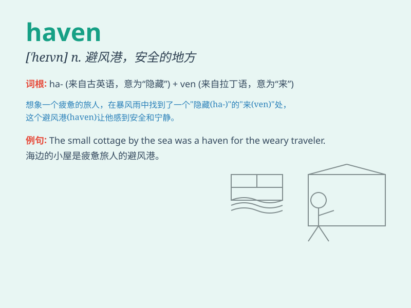

## haven

**英音:** _[\'heɪv(ə)n]_ **美音:** _[\'hevn]_

**译义:** *n.港口,避难所*

### 短语

+ **safe haven:** _安全港；避风港_

+ **haven of peace:** _和平的港湾_

+ **refuge haven:** _避难所_

+ **haven from sth:** _躲避某物的地方_

+ **haven for sb/sth:** _某人/某物的庇护所_

### 例句

#### 例句1

> **The small island is a haven for birds.**

**中文翻译:** 这座小岛是鸟类的天堂。

**单词释义:** 庇护所；避难所

#### 例句2

> **After a long day at work, home is my haven.**

**中文翻译:** 经过一天漫长的工作后，家就是我的避风港。

**单词释义:** 避风港

#### 例句3

> **The library is a haven of peace and quiet.**

**中文翻译:** 图书馆是一个宁静的港湾。

**单词释义:** 庇护所

### 背诵小故事

> A sailor was lost at sea for days. When he finally reached a peaceful
bay, he shouted, \'This is a haven!\' meaning a safe place. He could
rest and recover here without any fear.

**一位水手在海上迷失了好多天。当他最终到达一个宁静的海湾时，他大喊：'这是一个避风港！'意思是一个安全的地方。他可以在这里毫无畏惧地休息和恢复。**

### 图义

