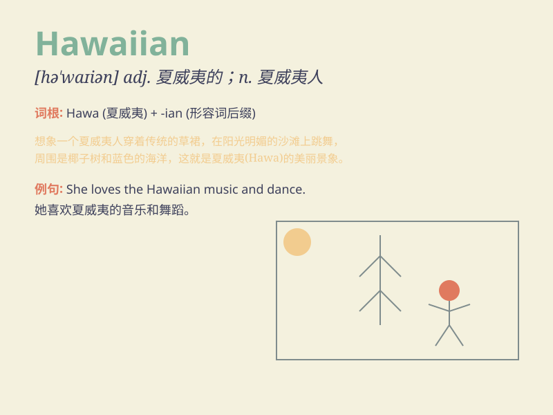

## Hawaiian

**英音:** _[həˈwaɪən]_ **美音:** _[həˈwaɪən]_

**译义:** *adj.夏威夷的；夏威夷人的；n.夏威夷人；夏威夷语*

### 短语

+ **Hawaiian shirt:** _夏威夷衬衫_

+ **Hawaiian music:** _夏威夷音乐_

+ **Hawaiian language:** _夏威夷语_

+ **Hawaiian Islands:** _夏威夷群岛_

+ **Hawaiian dance:** _夏威夷舞蹈_

### 例句

#### 例句1

> **The Hawaiian beaches are famous for their beauty.**

**中文翻译:** 夏威夷的海滩因其美丽而闻名。

**单词释义:** 夏威夷的；夏威夷人（或语）的

#### 例句2

> **She wore a Hawaiian shirt to the party.**

**中文翻译:** 她穿着一件夏威夷衬衫去参加聚会。

**单词释义:** 夏威夷的

#### 例句3

> **The Hawaiian music is very relaxing.**

**中文翻译:** 夏威夷音乐非常令人放松。

**单词释义:** 夏威夷的

### 背诵小故事

> A tourist went to Hawaii and met a friendly Hawaiian. The Hawaiian
showed him beautiful beaches and taught him how to dance. The tourist
had a wonderful time and will never forget the Hawaiian\'s kindness.

**一位游客去了夏威夷，遇到了一位友好的夏威夷人。这位夏威夷人给他展示了美丽的海滩，并教他跳舞。游客度过了一段美好的时光，永远不会忘记这位夏威夷人的友善。**

### 图义

