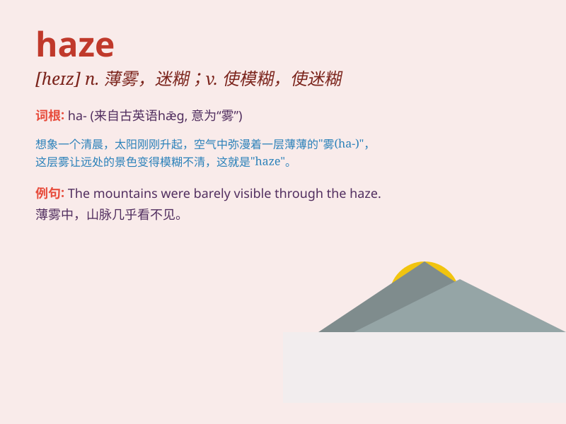

## haze

**英音:** _[heɪz]_ **美音:** _[hez]_

**译义:**
*n.薄雾,疑惑,阴霾vt.使变朦胧,使变糊涂,使劳累vi.变朦胧,变糊涂*

### 短语

+ **in a haze:** _茫然；困惑；迷糊_

+ **haze over:** _（使）变模糊；（使）朦胧_

+ **mental haze:** _精神恍惚_

+ **haze of smoke:** _烟雾弥漫_

+ **haze of dust:** _尘埃弥漫_

### 例句

#### 例句1

> **The mountains were shrouded in a haze.**

**中文翻译:** 群山笼罩在薄雾之中。

**单词释义:** 薄雾；霾

#### 例句2

> **He emerged from the haze of sleep.**

**中文翻译:** 他从睡梦中朦胧醒来。

**单词释义:** 迷糊；朦胧

#### 例句3

> **The incident cast a haze over their relationship.**

**中文翻译:** 这件事给他们的关系蒙上了一层阴影。

**单词释义:** 阴影；疑惑

### 背诵小故事

> A girl got lost in a forest on a hot summer day. The heat made the
air hazy. She couldn\'t see clearly and felt very worried. But finally,
she found her way out when the haze cleared.

**一个女孩在炎热的夏日里在森林中迷路了。高温使得空气朦胧。她看不清楚，感到非常担心。但最后，当朦胧消散时，她找到了出路。**

### 图义

