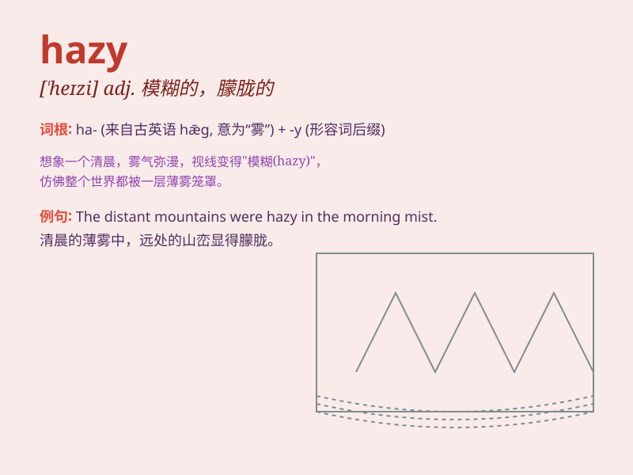

## hazy

**英音:** _[\'heɪzɪ]_ **美音:** _[\'hezi]_

**译义:** *adj.朦胧的,烟雾弥漫的,模糊的*

### 短语

+ **hazy memory:** _模糊的记忆_

+ **hazy weather:** _朦胧的天气_

+ **hazy vision:** _朦胧的视力_

+ **hazy outline:** _模糊的轮廓_

+ **hazy understanding:** _模糊的理解_

### 例句

#### 例句1

> **The view was hazy in the early morning fog.**

**中文翻译:** 在清晨的雾中，景色朦胧。

**单词释义:** 朦胧的；模糊不清的

#### 例句2

> **His memory of that event is rather hazy.**

**中文翻译:** 他对那件事的记忆相当模糊。

**单词释义:** 模糊的；不清晰的

#### 例句3

> **The future of the project remains hazy.**

**中文翻译:** 这个项目的未来仍不明朗。

**单词释义:** 不确定的；不明确的

### 背诵小故事

> One day, I went hiking in the mountains. The weather was hazy, and I
could hardly see the distant peaks. It felt like a mysterious veil
covered everything. Later, I learned that \'hazy\' means not clear or
foggy.

**有一天，我去山里徒步。天气朦胧，我几乎看不到远处的山峰。感觉就像一层神秘的面纱遮住了一切。后来，我知道了\'hazy\'意思是不清楚的、有雾的。**

### 图义

