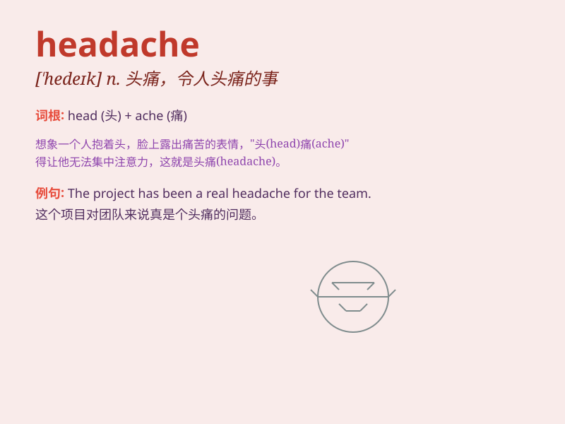

## headache

**英音:** _[\'hedeɪk]_ **美音:** _[ˈhɛdˌek]_

**译义:** *n.头痛,令人头痛之事*

### 短语

+ **have a headache:** _头疼；头痛_

+ **a splitting headache:** _剧烈的头痛_

+ **migraine headache:** _偏头痛_

+ **cluster headache:** _丛集性头痛_

+ **tension headache:** _紧张性头痛_

### 例句

#### 例句1

> **I have a splitting headache.**

**中文翻译:** 我头痛欲裂。

**单词释义:** 头痛

#### 例句2

> **The stress at work gave her a headache.**

**中文翻译:** 工作上的压力让她头痛。

**单词释义:** 头痛

#### 例句3

> **He took some medicine for his headache.**

**中文翻译:** 他吃了些药来治头痛。

**单词释义:** 头痛

### 背诵小故事

> One day, Tom had a very important exam. He stayed up late to study
and didn\'t get enough sleep. The next morning, when he woke up, he felt
a pain in his head. Oh no! He got a headache.

**有一天，汤姆有一场非常重要的考试。他熬夜学习，没有睡够。第二天早上，当他醒来时，他感到头部疼痛。哦，不！他头疼了。**

### 图义

