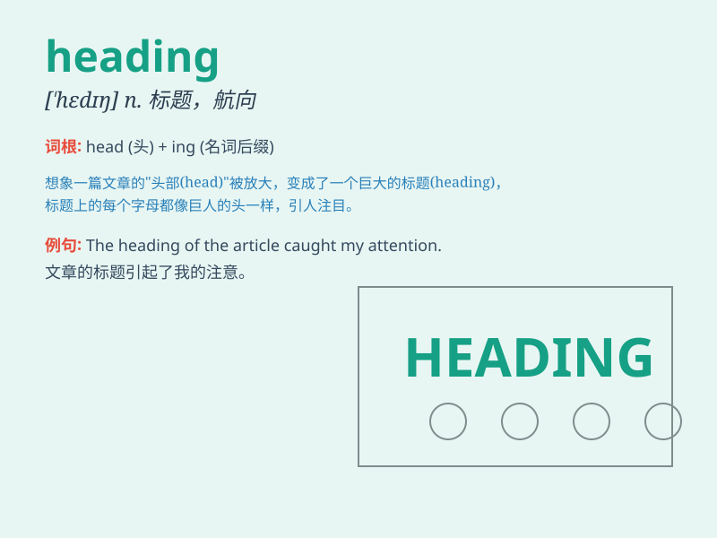

## heading

**英音:** _[\'hedɪŋ]_ **美音:** _[\'hɛdɪŋ]_

**译义:** *n.标题*

### 短语

+ **heading for:** _前往；走向_

+ **heading off:** _阻止；拦住；使改变方向_

+ **in the same heading:** _在同一方向_

+ **under the heading of:** _在...标题下；以...为标题_

+ **change of heading:** _航向改变；标题变更_

### 例句

#### 例句1

> **The heading of the article was very catchy.**

**中文翻译:** 这篇文章的标题非常吸引人。

**单词释义:** 标题

#### 例句2

> **We are heading north for our vacation.**

**中文翻译:** 我们正朝北去度假。

**单词释义:** 朝（某个方向）行进

#### 例句3

> **The ship was off heading when the storm hit.**

**中文翻译:** 风暴来袭时，船偏离了航向。

**单词释义:** 航向

### 背诵小故事

> One day, a lost traveler was in a forest. He had no idea which way to
go. Suddenly, he saw a sign with the word \'HEADING\' and an arrow
pointing north. It guided him to find the right path.

**一天，一个迷路的旅行者在森林里。他不知道该走哪条路。突然，他看到一个写着\'HEADING\'的标志和一个指向北方的箭头。它引导他找到了正确的道路。**

### 图义

