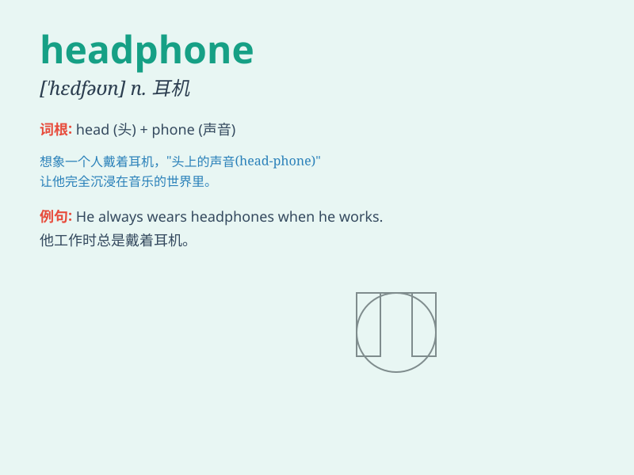

## headphone

**英音:** _[ˈhɛd.fəʊ.n]_ **美音:** _[ˈhɛd.fə.noʊ]_

**译义:**
*n.耳机，听筒（一般用于单数形式，常常与headphones混淆，后者为复数形式）*

### 短语

+ **wireless headphones:** _无线耳机_

+ **noise-cancelling headphones:** _降噪耳机_

+ **over-ear headphones:** _头戴式耳机_

+ **in-ear headphones:** _入耳式耳机_

+ **Bluetooth headphones:** _蓝牙耳机_

### 例句

#### 例句1

> **I always wear my headphones when I\'m on the train to enjoy
music.**

**中文翻译:** 我在火车上时总是戴着我的耳机来享受音乐。

**单词释义:** 耳机

#### 例句2

> **The quality of these headphones is excellent.**

**中文翻译:** 这些耳机的质量非常好。

**单词释义:** 耳机

#### 例句3

> **She lost one of her headphones and couldn\'t listen to music
properly.**

**中文翻译:** 她丢了一只耳机，无法正常听音乐了。

**单词释义:** 耳机

### 背诵小故事

> One day, a man was walking with a heavy head. Suddenly, he heard
beautiful music. It was coming from a pair of headphones on a bench. He
put them on and felt happy. Headphone - the thing that brings joy to
your ears!

**有一天，一个男人垂头丧气地走着。突然，他听到了美妙的音乐。声音是从长椅上的一副耳机传来的。他戴上耳机，感到很开心。耳机 -
给你的耳朵带来快乐的东西！**

### 图义

