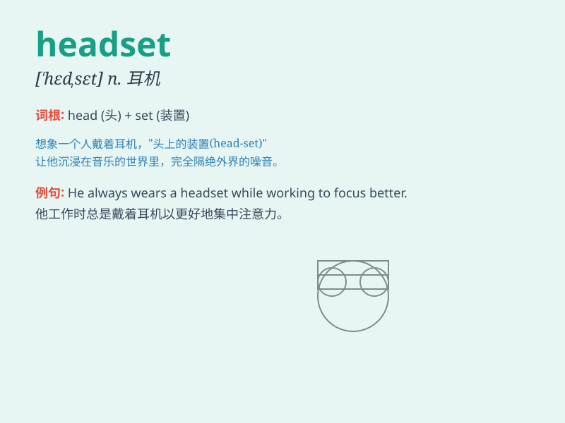

## headset

**英音:** _[\'hedset]_ **美音:** _[\'hɛd\'sɛt]_

**译义:** *n.戴在头上的耳机或听筒*

### 短语

+ **wireless headset:** _无线耳机_

+ **gaming headset:** _游戏耳机_

+ **noise-canceling headset:** _降噪耳机_

+ **virtual reality headset:** _虚拟现实头盔_

+ **Bluetooth headset:** _蓝牙耳机_

### 例句

#### 例句1

> **I put on my headset to listen to music.**

**中文翻译:** 我戴上我的耳机听音乐。

**单词释义:** 耳机

#### 例句2

> **The gamer wore a high-quality headset for better audio
experience.**

**中文翻译:** 这位游戏玩家戴着一个高质量的耳机以获得更好的音频体验。

**单词释义:** 耳机

#### 例句3

> **She adjusted the headset to get a comfortable fit.**

**中文翻译:** 她调整了耳机以获得舒适的佩戴感。

**单词释义:** 耳机

### 背诵小故事

> One day, Tom was playing a virtual reality game. But he couldn\'t
enjoy it because his headset was broken. He was very frustrated and
decided to buy a new one. Then he found a perfect headset and had a
great time.

**一天，汤姆正在玩虚拟现实游戏。但他无法享受，因为他的头戴式耳机坏了。他非常沮丧，决定买一个新的。然后他找到了一个完美的头戴式耳机，玩得很开心。**

### 图义

