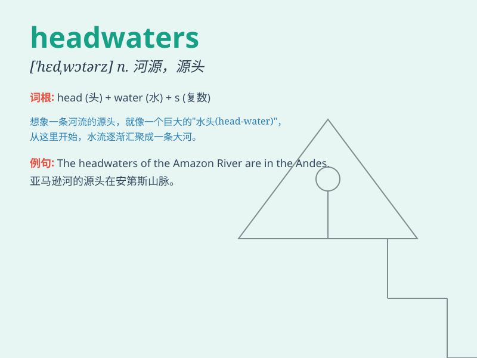

## headwaters

**英音:** _[\'hedwɔːtəz]_ **美音:** _[\'hɛdwɔtɚz]_

**译义:** *n.源头,上游*

### 短语

+ **headwaters region:** _河源地区_

+ **headwaters protection:** _河源保护_

+ **headwaters area:** _河源区域_

+ **upstream headwaters:** _上游河源_

+ **river headwaters:** _河流源头_

### 例句

#### 例句1

> **The headwaters of the river are in the mountains.**

**中文翻译:** 这条河的源头在山里。

**单词释义:** 源头；水源

#### 例句2

> **We followed the trail to the headwaters of the stream.**

**中文翻译:** 我们沿着小径走到了溪流的源头。

**单词释义:** 源头

#### 例句3

> **The expedition set out to explore the headwaters of the unknown
river.**

**中文翻译:** 探险队出发去探索那条未知河流的源头。

**单词释义:** 源头

### 背诵小故事

> A brave adventurer was lost in the mountains. He followed a small
stream, hoping it would lead him to safety. Little did he know that this
was the headwaters of a mighty river that would eventually guide him
home.

**一位勇敢的探险家在山里迷路了。他顺着一条小溪走，希望能找到出路。他不知道这是一条大河的源头，最终这条河引导他回了家。**

### 图义

