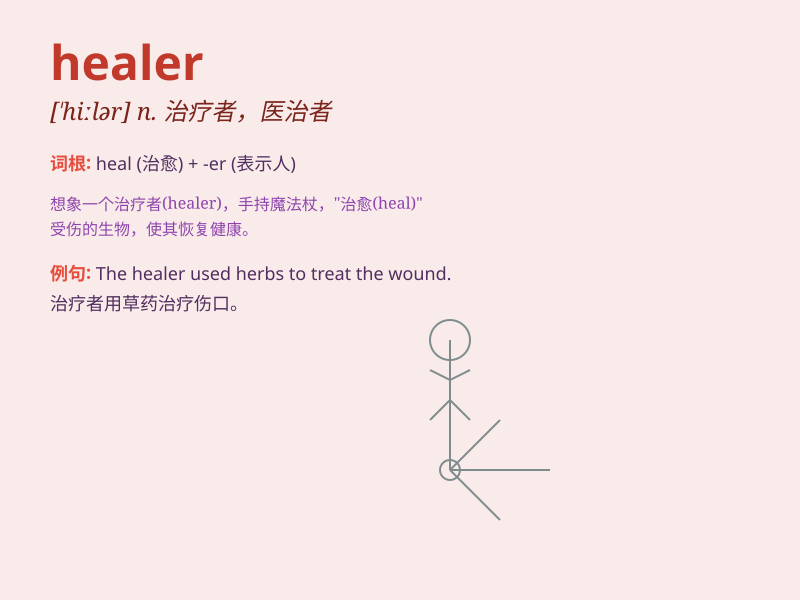

## healer

**英音:** _[\'hiːlə]_ **美音:** _[\'hilɚ]_

**译义:**
*n.医治者,(尤指用宗教迷信方式给人治病的人),治病术士,治疗物*

### 短语

+ **spiritual healer:** _精神治疗师_

+ **emotional healer:** _情感疗愈者_

+ **natural healer:** _自然治疗者_

+ **traditional healer:** _传统治疗师_

+ **wound healer:** _伤口治疗者_

### 例句

#### 例句1

> **The healer used various herbs to treat the patient\'s
illness.**

**中文翻译:** 治疗师使用各种草药来治疗病人的疾病。

**单词释义:** 治疗师

#### 例句2

> **She sought the help of a spiritual healer to overcome her
anxiety.**

**中文翻译:** 她寻求精神治疗师的帮助来克服焦虑。

**单词释义:** 治疗师

#### 例句3

> **The village relied on the local healer for their medical
needs.**

**中文翻译:** 该村依靠当地的治疗师来满足他们的医疗需求。

**单词释义:** 治疗师

### 背诵小故事

> Once upon a time, in a faraway village, there was a mysterious person
called the healer. Whenever someone was injured or ill, the healer would
appear with magical potions and cure them. People were grateful for this
wonderful healer.

**从前，在一个遥远的村庄，有一个神秘的人被称为治疗师。每当有人受伤或生病，治疗师就会带着神奇的药水出现并治愈他们。人们都很感激这位出色的治疗师。**

### 图义

