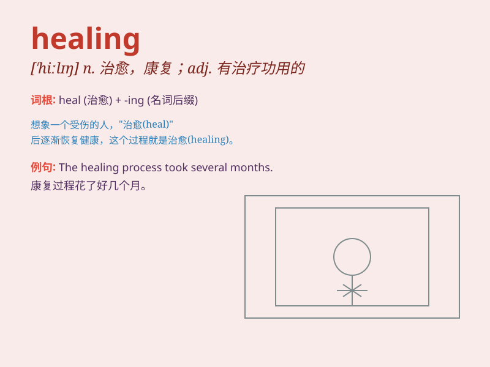

## healing

**英音:** _[\'hiːlɪŋ]_ **美音:** _[\'hilɪŋ]_

**译义:** *n.康复,复原adj.有治疗功用的*

### 短语

+ **healing process:** _愈合过程；康复过程_

+ **healing power:** _治愈力量；康复能力_

+ **healing touch:** _治愈之触；抚慰的触摸_

+ **healing effect:** _治疗效果；愈合效果_

+ **natural healing:** _自然愈合；自然疗法_

### 例句

#### 例句1

> **The healing process of the wound was slow.**

**中文翻译:** 伤口的愈合过程很缓慢。

**单词释义:** 愈合；康复

#### 例句2

> **Music has a healing power for the soul.**

**中文翻译:** 音乐具有治愈心灵的力量。

**单词释义:** 治愈；治疗

#### 例句3

> **She experienced a healing journey after the trauma.**

**中文翻译:** 创伤后的她经历了一次治愈之旅。

**单词释义:** 治愈；康复

### 背诵小故事

> Once upon a time, a wounded bird couldn\'t fly. But with the care and
love, it slowly started to recover. This process was like \'healing\'.
Just like when we have hurts, we need time and care to get better.

**从前，一只受伤的鸟无法飞翔。但在关爱下，它慢慢开始恢复。这个过程就像是'治愈'。就像我们受伤时，需要时间和关爱来变好。**

### 图义

