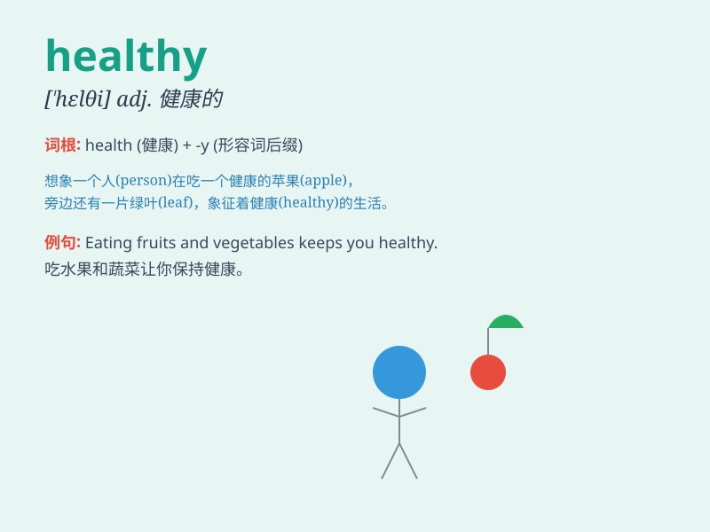

## healthy

**英音:** _[\'helθɪ]_ **美音:** _[\'hɛlθi]_

**译义:** *adj.健康的,健壮的,有益于健康的*

### 短语

+ **healthy diet:** _健康饮食_

+ **healthy lifestyle:** _健康的生活方式_

+ **healthy body:** _健康的身体_

+ **healthy environment:** _健康的环境_

+ **healthy habits:** _健康的习惯_

### 例句

#### 例句1

> **She has a healthy diet and exercises regularly.**

**中文翻译:** 她有健康的饮食习惯并定期锻炼。

**单词释义:** 健康的（指饮食）

#### 例句2

> **The children look very healthy.**

**中文翻译:** 孩子们看起来非常健康。

**单词释义:** 健康的（指人的状态）

#### 例句3

> **We need to keep our environment healthy.**

**中文翻译:** 我们需要保持环境健康。

**单词释义:** 健康的（指环境）

### 背诵小故事

> Once upon a time, there was a little boy named Tom. He ate fruits and
vegetables every day, exercised often, and had enough sleep. As a
result, he was always healthy and full of energy to play and study.

**从前，有个小男孩叫汤姆。他每天都吃水果和蔬菜，经常锻炼，睡眠充足。因此，他总是很健康，充满精力地玩耍和学习。**

### 图义

