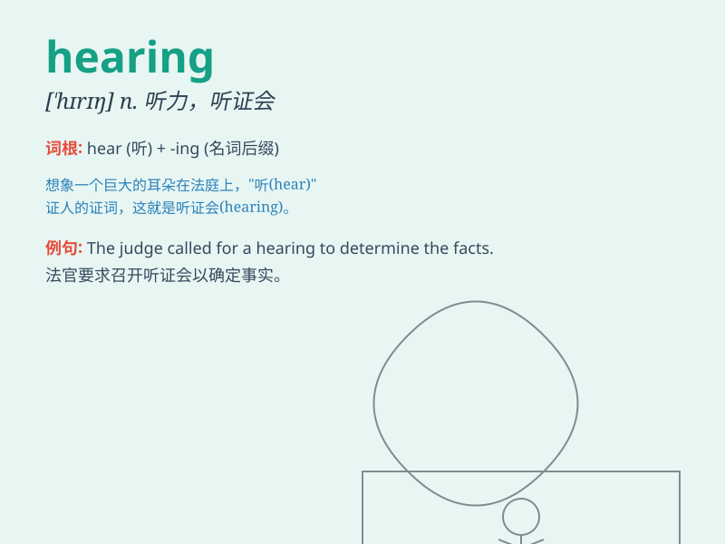

## hearing

**英音:** _[\'hɪərɪŋ]_ **美音:** _[\'hɪrɪŋ]_

**译义:** *n.听力,听觉,听取意见,听讼v.倾听*

### 短语

+ **hearing aid:** _助听器_

+ **public hearing:** _公开听证会_

+ **sense of hearing:** _听觉_

+ **lose one\'s hearing:** _丧失听力_

+ **within hearing:** _在听力所及的范围_

### 例句

#### 例句1

> **I have a good hearing and can hear sounds from a distance.**

**中文翻译:** 我的听力很好，可以听到远处的声音。

**单词释义:** 听力

#### 例句2

> **The hearing of the case was postponed until next month.**

**中文翻译:** 该案的审理被推迟至下个月。

**单词释义:** 听证会

#### 例句3

> **She lost her hearing after the accident.**

**中文翻译:** 事故发生后她失去了听力。

**单词释义:** 听力

### 背诵小故事

> One day, a little mouse was hiding in a corner. Suddenly, it heard a
loud noise. It was so scared because its hearing was very sharp and it
knew danger was coming.

**一天，一只小老鼠躲在角落里。突然，它听到了一声巨响。它非常害怕，因为它的听力非常敏锐，它知道危险来临了。**

### 图义

