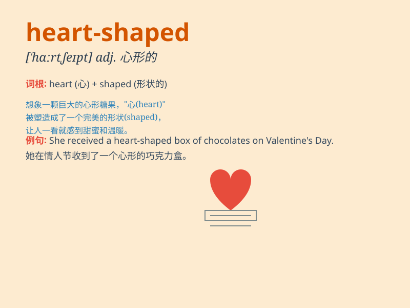

## heart-shaped

**英音:** _[ˈhɑːt ʃeɪpt]_ **美音:** _[ˈhɑːrt ʃeɪpt]_

**译义:** *adj.心形的*

### 短语

+ **heart-shaped cake:** _心形蛋糕_

+ **heart-shaped pendant:** _心形吊坠_

+ **heart-shaped box:** _心形盒子_

+ **heart-shaped leaf:** _心形叶子_

+ **heart-shaped cookie:** _心形饼干_

### 例句

#### 例句1

> **She wore a heart-shaped pendant around her neck.**

**中文翻译:** 她脖子上戴了一个心形的吊坠。

**单词释义:** 心形的（形容吊坠的形状）

#### 例句2

> **The cookies were cut into heart-shaped pieces.**

**中文翻译:** 这些饼干被切成了心形的小块。

**单词释义:** 心形的（形容饼干的形状）

#### 例句3

> **He gave her a heart-shaped box of chocolates on Valentine\'s
Day.**

**中文翻译:** 在情人节他给了她一个心形的巧克力盒子。

**单词释义:** 心形的（形容盒子的形状）

### 背诵小故事

> Once upon a time, there was a little girl who loved making cookies.
One day, she made some special cookies that were heart-shaped. They
looked so lovely, just like a symbol of love. Everyone was happy to see
these heart-shaped treats.

**从前，有一个小女孩喜欢做饼干。有一天，她做了一些特别的饼干，是心形的。它们看起来非常可爱，就像爱的象征。每个人看到这些心形的点心都很开心。**

### 图义

