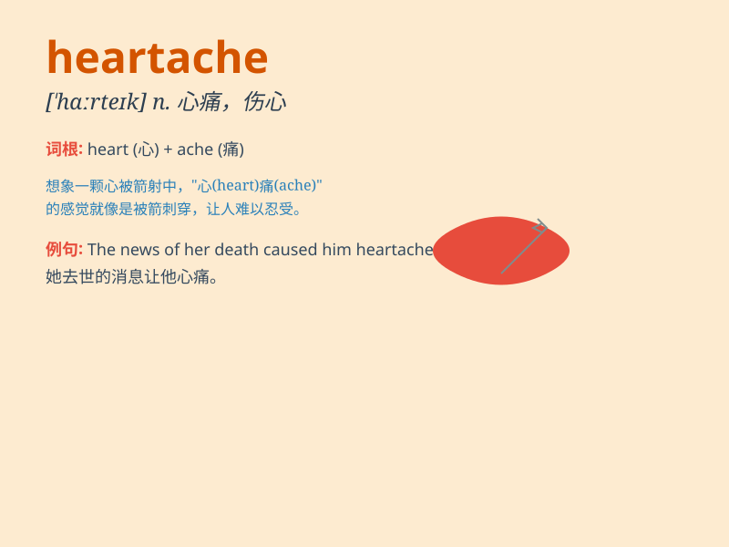

## heartache

**英音:** _[\'hɑːteɪk]_ **美音:** _[\'hɑrtek]_

**译义:** *n.心痛,悲叹*

### 短语

+ **intense heartache:** _强烈的心痛_

+ **endless heartache:** _无尽的心痛_

+ **bear heartache:** _承受心痛_

+ **relieve heartache:** _减轻心痛_

+ **deep heartache:** _深深的心痛_

### 例句

#### 例句1

> **The loss of her pet brought her a lot of heartache.**

**中文翻译:** 失去宠物给她带来了很大的心痛。

**单词释义:** 痛苦；心痛

#### 例句2

> **He has endured years of heartache over his failed marriage.**

**中文翻译:** 多年来，他因失败的婚姻而承受着心痛。

**单词释义:** 心痛；悲伤

#### 例句3

> **The story is full of heartache and longing.**

**中文翻译:** 故事充满了心痛和憧憬。

**单词释义:** 心痛；伤心

### 背诵小故事

> A young couple deeply in love had to part ways. The boy felt a sharp
pain in his heart, as if it was being torn apart. This pain was the
\'heartache\' he experienced from losing his love.

**一对深爱的年轻情侣不得不分开。男孩感到内心一阵剧痛，仿佛心被撕裂。这种痛苦就是他失去爱人所经历的"心痛；伤心"。**

### 图义

