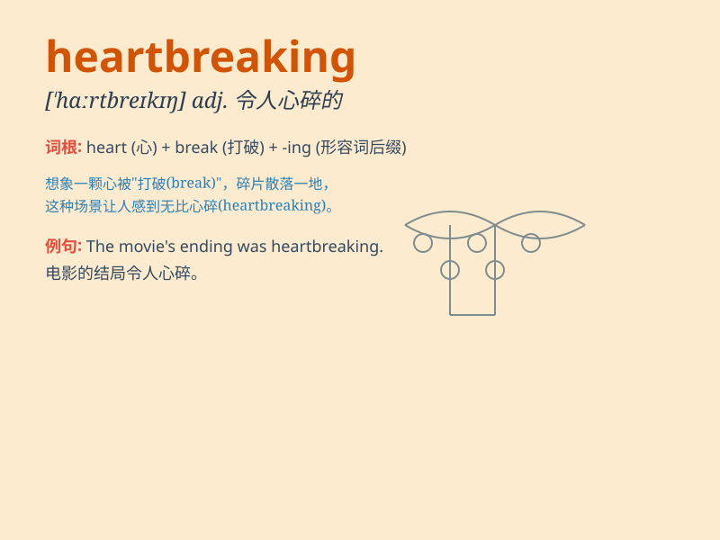

## heartbreaking

**英音:** _[ˈhɑːtbreɪkɪŋ]_ **美音:** _[ˈhɑːrtbreɪkɪŋ]_

**译义:** *adj.悲伤或失望到难忍程度的,无聊的,讨厌的*

### 短语

+ **heartbreaking news:** _令人心碎的消息_

+ **heartbreaking story:** _令人心碎的故事_

+ **heartbreaking scene:** _令人心碎的场景_

+ **heartbreaking decision:** _令人心碎的决定_

+ **heartbreaking experience:** _令人心碎的经历_

### 例句

#### 例句1

> **The news of his death was heartbreaking.**

**中文翻译:** 他去世的消息令人心碎。

**单词释义:** 令人心碎的

#### 例句2

> **It was a heartbreaking story of lost love.**

**中文翻译:** 这是一个关于失去爱情的令人心碎的故事。

**单词释义:** 令人心碎的

#### 例句3

> **The sight of the starving children was heartbreaking.**

**中文翻译:** 看到孩子们挨饿的情景，令人心碎。

**单词释义:** 令人心碎的

### 背诵小故事

> A young couple was deeply in love. But one day, the boy had to leave
for a distant place and never returned. The girl\'s heart was broken.
This sad situation is truly heartbreaking.

**一对年轻的情侣深深相爱。但有一天，男孩不得不去远方且再也没有回来。女孩的心碎了。这种悲伤的情形真的令人心碎。**

### 图义

