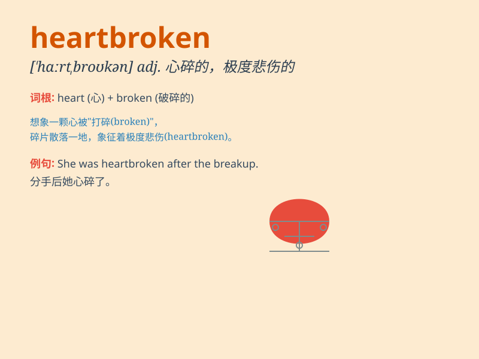

## heartbroken

**英音:** _[\'hɑːtbrəʊkən]_ **美音:** _[\'hɑrtbrokən]_

**译义:** *adj.悲伤的*

### 短语

+ **be heartbroken over:** _因\...\...而心碎_

+ **heartbroken tears:** _心碎的眼泪_

+ **feel heartbroken:** _感到心碎_

+ **a heartbroken story:** _一个令人心碎的故事_

+ **heartbroken sigh:** _心碎的叹息_

### 例句

#### 例句1

> **She was heartbroken when she heard the news of her pet\'s
death.**

**中文翻译:** 当她听到宠物去世的消息时，她心碎了。

**单词释义:** 极度悲伤的，心碎的

#### 例句2

> **The heartbroken man sat alone in the park, lost in his
thoughts.**

**中文翻译:** 伤心欲绝的男人独自坐在公园里，陷入沉思。

**单词释义:** 心碎的，极度伤心的

#### 例句3

> **After the breakup, she became completely heartbroken and
couldn\'t focus on anything.**

**中文翻译:** 分手后，她彻底心碎，无法集中注意力。

**单词释义:** 心碎的，伤心欲绝的

### 背诵小故事

> A young man had a deep love for a girl. But the girl left him for
someone else. The young man was heartbroken. His heart felt as if it
were shattered into pieces. He couldn\'t stop crying.

**一个年轻男子深深地爱着一个女孩。但女孩为了别人离开了他。这个年轻男子心碎了。他的心感觉好像碎成了一片片。他止不住地哭泣。**

### 图义

