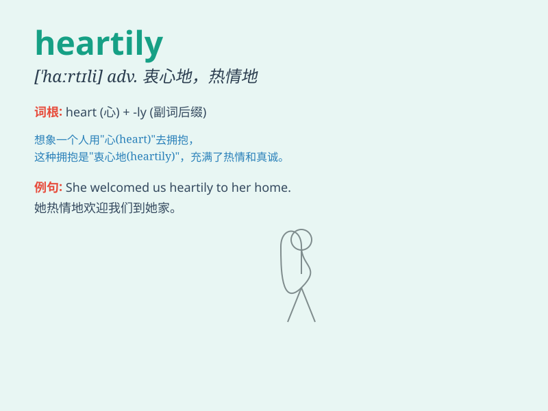

## heartily

**英音:** _[\'hɑːtɪlɪ]_ **美音:** _[\'hɑrtɪli]_

**译义:** *adv.热忱地*

### 短语

+ **heartily recommend:** _衷心推荐_

+ **laugh heartily:** _开怀大笑_

+ **eat heartily:** _尽情地吃_

+ **agree heartily:** _由衷地同意_

+ **welcome heartily:** _热忱欢迎_

### 例句

#### 例句1

> **They heartily enjoyed the meal.**

**中文翻译:** 他们吃得很开心。

**单词释义:** 尽情地

#### 例句2

> **She laughed heartily at the joke.**

**中文翻译:** 她听了这个笑话，开怀大笑。

**单词释义:** 开怀地

#### 例句3

> **He heartily congratulated his friend on the success.**

**中文翻译:** 他衷心祝贺朋友的成功。

**单词释义:** 衷心地

### 背诵小故事

> Once upon a time, there was a tired traveler. When he reached a
village, the villagers welcomed him heartily, with big smiles and warm
hugs. It made him feel truly loved and cared for.

**从前，有一个疲惫的旅行者。当他到达一个村庄时，村民们热情地欢迎他，带着大大的微笑和温暖的拥抱。这让他真心地感受到了爱和关怀。**

### 图义

