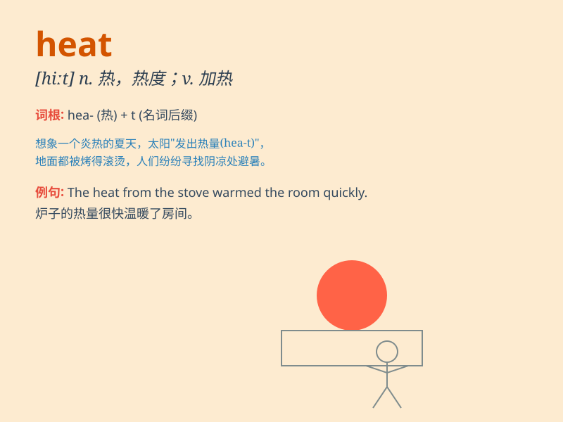

## heat

**英音:** _[hiːt]_ **美音:** _[hit]_

**译义:** *n.热,热度;激动,热情;热烈的讨论vt.加热,使变热;刺激,激励*

### 短语

+ **heat up:** _加热；变热；使升温_

+ **heat stroke:** _中暑_

+ **heat treatment:** _热处理_

+ **heat wave:** _热浪；热波_

+ **in the heat of the moment:** _一时冲动之下；盛怒之下_

### 例句

#### 例句1

> **The heat from the fire made the room very warm.**

**中文翻译:** 火产生的热量使房间变得非常温暖。

**单词释义:** 热量

#### 例句2

> **You should turn off the heat before leaving the house.**

**中文翻译:** 在离开房子之前你应该关掉暖气。

**单词释义:** 暖气

#### 例句3

> **The heat of the competition drove the athletes to perform their
best.**

**中文翻译:** 比赛的激烈促使运动员们发挥出最佳水平。

**单词释义:** 激烈

### 背诵小故事

> One hot summer day, the sun was shining brightly and giving off a lot
of heat. People were sweating and looking for shade. A dog was lying on
the ground, panting because of the heat. It made us all realize how
powerful the heat can be.

**在一个炎热的夏日，阳光灿烂，释放出大量的热。人们汗流浃背，寻找阴凉处。一只狗躺在地上，因为热而喘气。这让我们都意识到热的威力有多大。**

### 图义

