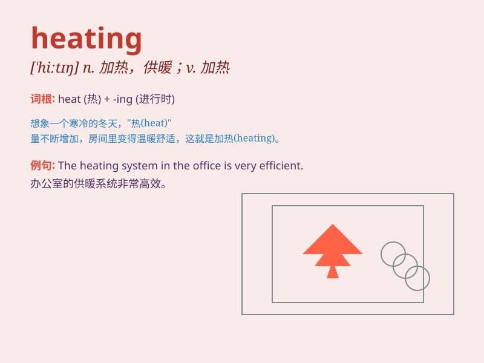

## heating

**英音:** _[\'hiːtɪŋ]_ **美音:** _[\'hitɪŋ]_

**译义:** *v.加热*

### 短语

+ **central heating:** _中央供暖系统_

+ **heating system:** _供暖系统；加热系统_

+ **heating element:** _加热元件；发热元件_

+ **heating oil:** _取暖用油；加热用油_

+ **heating pad:** _加热垫；暖垫_

### 例句

#### 例句1

> **The heating in the room is not working properly.**

**中文翻译:** 房间里的暖气不能正常工作。

**单词释义:** 供暖；加热

#### 例句2

> **We need to install a new heating system for the winter.**

**中文翻译:** 我们需要为冬天安装新的供暖系统。

**单词释义:** 供暖系统

#### 例句3

> **The cost of heating has increased this year.**

**中文翻译:** 今年取暖费有所增加。

**单词释义:** 供暖；供热

### 背诵小故事

> In a cold winter, Tom was shivering. But when he turned on the
heating system, the room gradually became warm and cozy. He finally felt
comfortable and could enjoy reading his favorite book.

**在一个寒冷的冬天，汤姆冻得瑟瑟发抖。但当他打开供暖系统后，房间逐渐变得温暖舒适。他终于感到惬意，可以享受阅读他最喜欢的书了。**

### 图义

