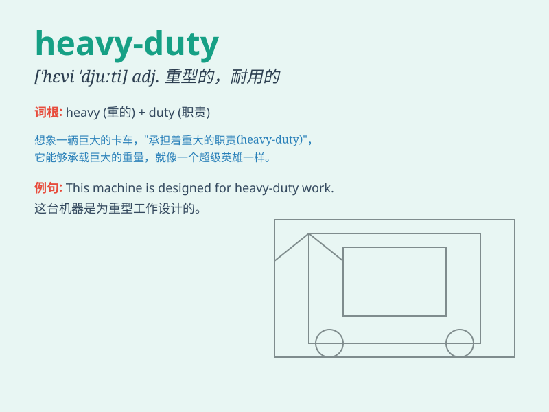

## heavy-duty

**英音:** _[ˈhevi ˈdjuːti]_ **美音:** _[ˈhevi ˈduːti]_

**译义:** *adj. 重型的；耐用的；强力的；耐用的；适用于重负荷的*

### 短语

+ **heavy-duty vehicle:** _重型车辆_

+ **heavy-duty equipment:** _重型设备_

+ **heavy-duty work:** _繁重的工作_

+ **heavy-duty battery:** _重型电池_

+ **heavy-duty fabric:** _厚重的织物_

### 例句

#### 例句1

> **This is a heavy-duty truck designed for long-haul
transportation.**

**中文翻译:** 这是一辆专为长途运输设计的重型卡车。

**单词释义:** 重型的；耐用的

#### 例句2

> **We need heavy-duty machinery to complete this project.**

**中文翻译:** 我们需要重型机械来完成这个项目。

**单词释义:** 重型的；耐用的

#### 例句3

> **The heavy-duty boots are perfect for hiking in rough terrain.**

**中文翻译:** 这双耐用的靴子非常适合在崎岖的地形中徒步旅行。

**单词释义:** 耐用的；结实的

### 背诵小故事

>
想象一下，在一个巨大的工厂里，有一台超级强壮的机器，它不分昼夜地工作，承担着最繁重、最艰难的任务。这台机器就是\'heavy-duty\'的代表，意味着结实耐用、重型的。

**想象在工厂里有台承担繁重艰难任务的超级强壮机器，以此代表 heavy-duty
意为结实耐用、重型的。**

### 图义

