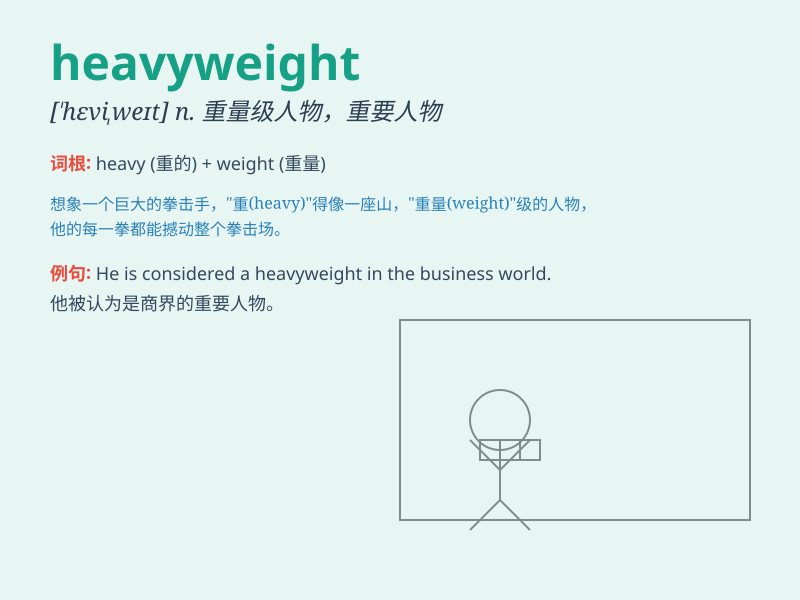

## heavyweight

**英音:** _[\'hevɪweɪt]_ **美音:** _[\'hɛvɪwet]_

**译义:**
*n.特别重的人(或物),最重量级拳击手(或摔交手),聪明绝顶的人*

### 短语

+ **heavyweight champion:** _重量级冠军_

+ **heavyweight boxer:** _重量级拳击手_

+ **heavyweight division:** _重量级分区_

+ **heavyweight contender:** _有实力竞争重量级冠军的选手_

+ **heavyweight fight:** _重量级比赛_

### 例句

#### 例句1

> **The heavyweight boxer knocked out his opponent in the first
round.**

**中文翻译:** 这位重量级拳击手在第一轮就击倒了对手。

**单词释义:** 重量级的（指拳击手）

#### 例句2

> **He is a heavyweight in the business world.**

**中文翻译:** 他是商界的重量级人物。

**单词释义:** 有影响力的（指人物）

#### 例句3

> **The heavyweight champion defended his title successfully.**

**中文翻译:** 这位重量级冠军成功卫冕。

**单词释义:** 重量级的（指冠军）

### 背诵小故事

> In the boxing ring, there was a huge and powerful fighter called the
heavyweight. He was so strong that no one could easily push him down.
His heavyweight body made him a tough opponent.

**在拳击台上，有一个巨大且有力的拳击手被称为重量级选手。他非常强壮，没人能轻易将他打倒。他那重量级的身躯使他成为一个强劲的对手。**

### 图义

