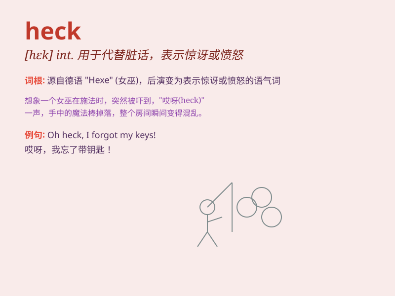

## heck

**英音:** _[hek]_ **美音:** _[hɛk]_

**译义:** *n.饲草架*

### 短语

+ **heck of a:** _非常；极其_

+ **what the heck:** _究竟，到底（表示不在乎、无可奈何或气恼）_

+ **for the heck of it:** _只是为了好玩；无缘无故_

+ **heck no:** _绝对不；当然不_

+ **heck yeah:** _当然；绝对_

### 例句

#### 例句1

> **Heck, I don\'t even know where to start.**

**中文翻译:** 哎呀，我什至不知道从哪里开始。

**单词释义:** 表示惊讶、烦恼或强调

#### 例句2

> **What the heck is going on here?**

**中文翻译:** 这到底是怎么回事？

**单词释义:** 用于加强语气，表达愤怒、困惑

#### 例句3

> **Heck, you should have seen the look on her face!**

**中文翻译:** 哎呀，你应该看看她脸上的表情！

**单词释义:** 表示惊讶或强调

### 背诵小故事

> One day, a little boy was playing in the park. Suddenly, he lost his
toy. He shouted, \'Heck! Where is my toy?\' It means expressing
annoyance or frustration.

**有一天，一个小男孩在公园玩耍。突然，他弄丢了自己的玩具。他大喊：'哎呀！我的玩具在哪儿？'
这个词意思是表示烦恼或沮丧。**

### 图义

