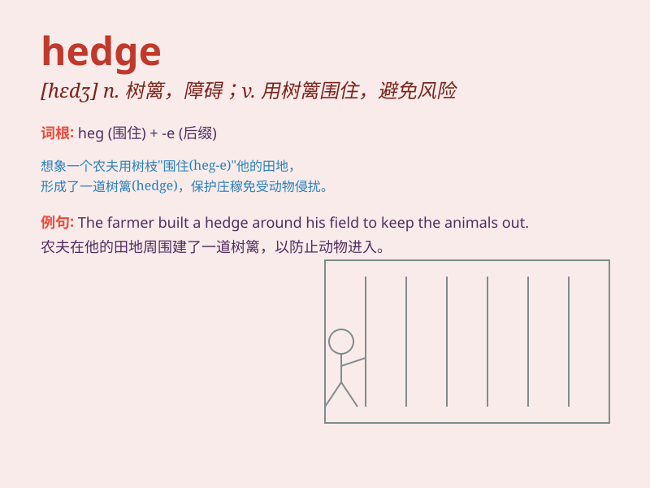

## hedge

**英音:** _[hedʒ]_ **美音:** _[hɛdʒ]_

**译义:** *n.树篱,障碍物v.用树篱围住,避免作正面答复*

### 短语

+ **hedge fund:** _对冲基金_

+ **hedge against:** _防范；规避_

+ **hedge row:** _树篱；一排树篱_

+ **hedge one\'s bets:** _两面下注；留有余地_

+ **be on the hedge:** _骑墙；持观望态度_

### 例句

#### 例句1

> **He planted a hedge to separate the two gardens.**

**中文翻译:** 他种了一道树篱来分隔两个花园。

**单词释义:** 树篱；篱笆

#### 例句2

> **The company took measures to hedge against currency
fluctuations.**

**中文翻译:** 该公司采取措施对冲货币波动。

**单词释义:** 避免；防范

#### 例句3

> **She hedged her bets by investing in several different stocks.**

**中文翻译:** 她通过投资几只不同的股票来对冲她的赌注。

**单词释义:** 两面下注；（对所说的话）不作出肯定

### 背诵小故事

> A little rabbit was playing in the field. To protect itself from
danger, it found a hedge and hid behind it. The hedge was like a safe
shield. So, remember, \'hedge\' means a row of bushes or a way to
protect.

**一只小兔子在田野里玩耍。为了保护自己免受危险，它找到了一排树篱并躲在后面。这排树篱就像一个安全的盾牌。所以，记住，\'hedge\'意思是树篱或保护手段。**

### 图义

