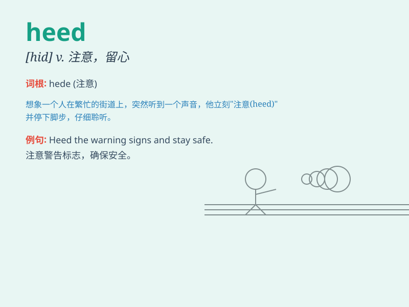

## heed

**英音:** _[hiːd]_ **美音:** _[hid]_

**译义:** *n.注意,留意v.注意,留意*

### 短语

+ **heed warning:** _注意警告_

+ **pay heed to:** _注意；留意_

+ **take heed of:** _留意；当心_

+ **heed carefully:** _仔细留意_

+ **heed advice:** _听从劝告_

### 例句

#### 例句1

> **He seldom heeds my advice.**

**中文翻译:** 他很少听从我的建议。

**单词释义:** 理会；注意

#### 例句2

> **You should heed the warning signs on the road.**

**中文翻译:** 您应该留意路上的警告标志。

**单词释义:** 注意

#### 例句3

> **If you don\'t heed my words, you\'ll regret it.**

**中文翻译:** 如果你不听我的话，你会后悔的。

**单词释义:** 听从

### 背诵小故事

> A brave knight was on a dangerous quest. But he didn\'t heed the
warnings of the old sage. As a result, he got lost. Only then did he
realize the importance of heeding advice.

**一位勇敢的骑士正在进行危险的探索。但他没有留意老智者的警告。结果，他迷路了。只有那时他才意识到留意建议的重要性。**

### 图义

