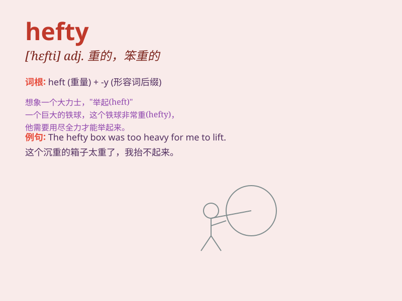

## hefty

**英音:** _[\'heftɪ]_ **美音:** _[\'hɛfti]_

**译义:** *adj.重的,肌肉发达的*

### 短语

+ **hefty fine:** _巨额罚款_

+ **hefty sum:** _大笔金额_

+ **hefty price:** _高昂的价格_

+ **hefty task:** _艰巨的任务_

+ **hefty blow:** _沉重的打击_

### 例句

#### 例句1

> **He lifted the hefty box with great effort.**

**中文翻译:** 他费了很大的力气才把那个沉重的盒子举起来。

**单词释义:** 重的；沉重的

#### 例句2

> **The hefty man struggled to fit through the narrow door.**

**中文翻译:** 身材魁梧的男人费力地钻进狭窄的门。

**单词释义:** 高大健壮的；大块头的

#### 例句3

> **She was handed a hefty fine for speeding.**

**中文翻译:** 她因超速行驶而被处以巨额罚款。

**单词释义:** 大量的；巨额的

### 背诵小故事

> One day, a hefty man was trying to lift a heavy box. But he struggled
a lot because of his big size and the box\'s weight. \'Hefty\' here
means large and heavy.

**一天，一个大块头的男人试图抬起一个很重的箱子。但由于他体型庞大和箱子的重量，他非常吃力。这里'hefty'意思是大而重的。**

### 图义

