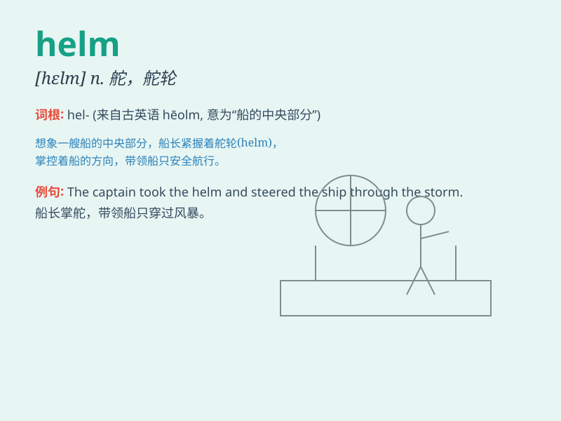

## helm

**英音:** _[helm]_ **美音:** _[hɛlm]_

**译义:** *n. 舵，舵柄；领导地位；头盔；盔状物*

### 短语

+ **at the helm:** _负责；掌管_

+ **take the helm:** _担任领导；掌管_

+ **helm of a ship:** _船舵_

+ **helm control:** _舵控_

+ **helm position:** _舵位_

### 例句

#### 例句1

> **He took the helm of the company during a difficult time.**

**中文翻译:** 在困难时期，他掌管了公司。

**单词释义:** 掌管；舵柄

#### 例句2

> **The captain steered the ship from the helm.**

**中文翻译:** 船长在舵柄处操纵船只。

**单词释义:** 舵柄

#### 例句3

> **She is at the helm of the project and ensures its success.**

**中文翻译:** 她负责这个项目并确保其成功。

**单词释义:** 负责；掌管

### 背诵小故事

> A brave captain held the helm of the ship firmly during a fierce
storm. The helm guided the ship safely through the waves. With the helm
in control, they reached the harbor.

**一位勇敢的船长在狂风暴雨中紧紧握住船舵。船舵引导船只安全地穿越海浪。在船舵的掌控下，他们抵达了港口。**

### 图义

