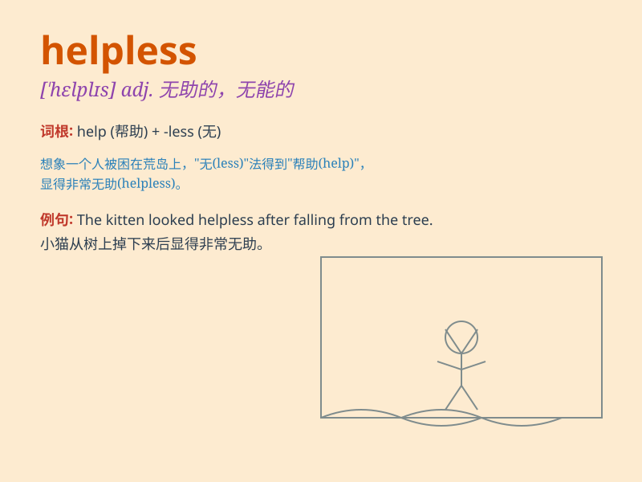

## helpless

**英音:** _[\'helplɪs]_ **美音:** _[\'hɛlpləs]_

**译义:** *adj.无助的,无能的,没用的*

### 短语

+ **helpless child:** _无助的孩子_

+ **feel helpless:** _感到无助_

+ **helpless situation:** _无助的局面_

+ **utterly helpless:** _完全无助_

+ **be helpless against:** _对\...\...无能为力_

### 例句

#### 例句1

> **The child felt helpless when he lost his way.**

**中文翻译:** 这个孩子迷路时感到无助。

**单词释义:** 无助的

#### 例句2

> **They were helpless in the face of the disaster.**

**中文翻译:** 面对灾难，他们无能为力。

**单词释义:** 无能为力的

#### 例句3

> **She looked helpless as she struggled with the heavy luggage.**

**中文翻译:** 她费力地提着沉重的行李，看上去很无助。

**单词释义:** 无助的

### 背诵小故事

> One day, a little bird fell from its nest. It couldn\'t fly back and
was helpless. Just then, a kind girl came and helped it. The bird was no
longer helpless and flew happily again.

**有一天，一只小鸟从巢里掉了下来。它飞不回去，很无助。就在这时，一个善良的女孩过来帮助了它。小鸟不再无助，又快乐地飞了起来。**

### 图义

