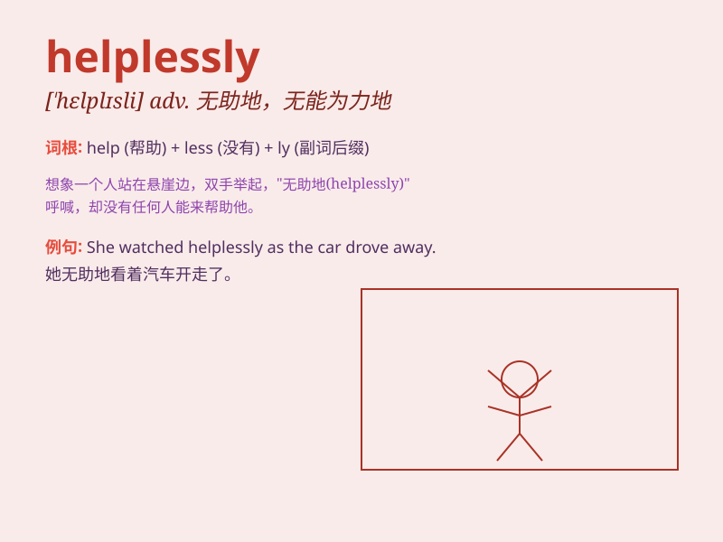

## helplessly

**英音:** _[\'helpləsli]_ **美音:** _[\'helpləsli]_

**译义:** *adv.无能为力地,无望地*

### 短语

+ **cry helplessly:** _无助地哭泣_

+ **stand helplessly:** _无助地站着_

+ **watch helplessly:** _无助地看着_

+ **shrug helplessly:** _无奈地耸肩_

+ **sigh helplessly:** _无奈地叹气_

### 例句

#### 例句1

> **She watched helplessly as her house burned down.**

**中文翻译:** 她眼睁睁地看着自己的房子被烧毁。

**单词释义:** 无助地

#### 例句2

> **He stood helplessly by the roadside, not knowing what to do.**

**中文翻译:** 他无助地站在路边，不知道该怎么办。

**单词释义:** 无奈地

#### 例句3

> **The injured bird fluttered helplessly on the ground.**

**中文翻译:** 受伤的鸟儿在地上无助地扑腾着。

**单词释义:** 无能为力地

### 背诵小故事

> One day, a little bird fell from its nest. It tried to fly but
couldn\'t and lay on the ground helplessly. Just then, a kind girl came
and helped it back to the nest.

**有一天，一只小鸟从巢里掉了下来。它试图飞翔但做不到，无助地躺在地上。就在这时，一个善良的女孩过来把它送回了巢里。**

### 图义

