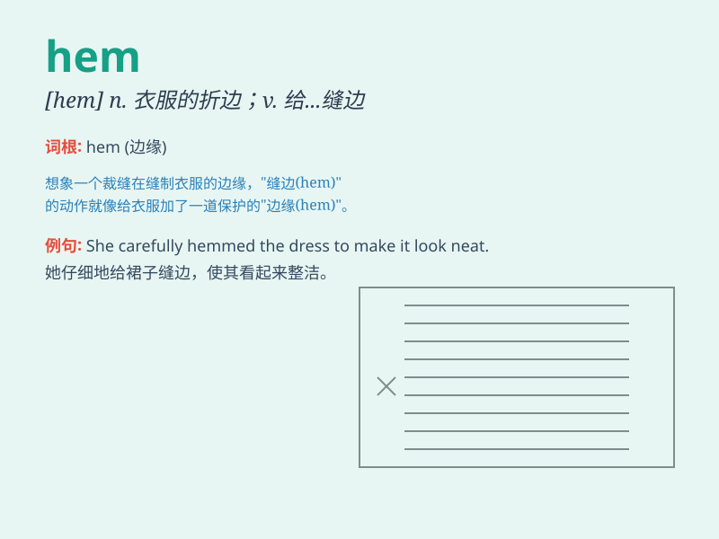

## hem

**英音:** _[hem]_ **美音:** _[hɛm]_

**译义:** *n.边,缘,摺边v.给\...缝边,包围*

### 短语

+ **hem and haw:** _支支吾吾；犹豫；踌躇_

+ **hem in:** _包围；限制_

+ **hem stitch:** _折边缝；卷边缝_

+ **hem of a dress:** _连衣裙的下摆_

+ **hem the skirt:** _给裙子缝边_

### 例句

#### 例句1

> **She hemmed the skirt to make it shorter.**

**中文翻译:** 她给裙子缝边以使它变短。

**单词释义:** 给\...缝边

#### 例句2

> **The dress has a beautiful hem.**

**中文翻译:** 这件连衣裙有漂亮的下摆。

**单词释义:** （衣服或织物的）褶边，下摆

#### 例句3

> **He hemmed and hawed when asked about his plans.**

**中文翻译:** 当被问到他的计划时，他支支吾吾。

**单词释义:** 支吾，犹豫

### 背诵小故事

>
想象一下，你穿着一条漂亮的裙子，但是裙摆太长了，总是妨碍你走路。于是你决定把裙摆折起来一点，这个折起来的部分就是\'hem\'。就像给裙子加上了一个边缘装饰，让它更完美。

**想象你穿裙子折裙摆的情景来记住\'hem（边缘；折边）\'这个单词**

### 图义

