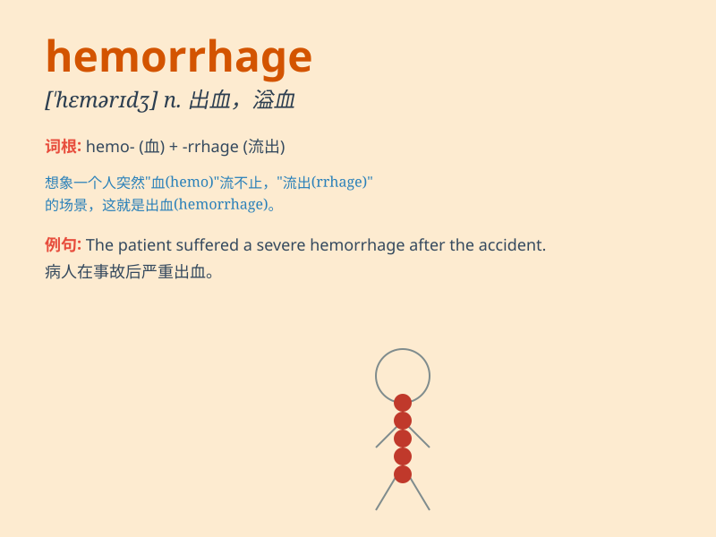

## hemorrhage

**英音:** _[\'hemərɪdʒ]_ **美音:** _[\'hɛmərɪdʒ]_

**译义:** *n.出血*

### 短语

+ **cerebral hemorrhage:** _脑出血_

+ **intracranial hemorrhage:** _颅内出血_

+ **postpartum hemorrhage:** _产后出血_

+ **gastrointestinal hemorrhage:** _胃肠道出血_

+ **hemorrhage of the retina:** _视网膜出血_

### 例句

#### 例句1

> **The patient suffered a severe hemorrhage after the accident.**

**中文翻译:** 这位病人在事故后出现了严重的出血。

**单词释义:** 出血

#### 例句2

> **The company is experiencing a financial hemorrhage due to poor
management.**

**中文翻译:** 由于管理不善，这家公司正在经历财务上的大出血。

**单词释义:** 大量流失（资金等）

#### 例句3

> **The athlete\'s injury led to a hemorrhage of energy during the
competition.**

**中文翻译:** 这位运动员的受伤导致在比赛中精力大量消耗。

**单词释义:** 大量消耗（精力等）

### 背诵小故事

> A brave doctor was in the emergency room. A patient came in with a
severe hemorrhage. The doctor acted quickly to stop the bleeding and
save the patient\'s life. Remember, \'hemorrhage\' means a lot of blood
flowing out.

**一位勇敢的医生在急诊室。一名患者因严重出血进来。医生迅速行动以止血并挽救患者生命。记住，\'hemorrhage\'意思是大量血液流出。**

### 图义

