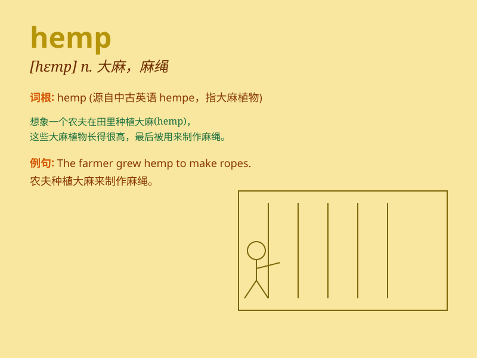

## hemp

**英音:** _[hemp]_ **美音:** _[hɛmp]_

**译义:** *n.大麻,纤维*

### 短语

+ **hemp fiber:** _大麻纤维_

+ **hemp rope:** _麻绳_

+ **hemp fabric:** _大麻织物_

+ **hemp seed:** _大麻籽_

+ **industrial hemp:** _工业大麻_

### 例句

#### 例句1

> **Hemp is used to make ropes and fabrics.**

**中文翻译:** 大麻被用于制造绳索和织物。

**单词释义:** 大麻（植物）

#### 例句2

> **The farmers are growing hemp this year.**

**中文翻译:** 今年农民们正在种植大麻。

**单词释义:** 大麻（植物）

#### 例句3

> **Hemp products are becoming more popular.**

**中文翻译:** 大麻制品正变得越来越受欢迎。

**单词释义:** 大麻

### 背诵小故事

> A farmer was growing hemp on his land. One day, a thief tried to
steal the hemp. But the farmer caught the thief and said, \'This hemp is
not for stealing!\'

**一位农民在他的土地上种植大麻。有一天，一个小偷试图偷大麻。但农民抓住了小偷并说：'这大麻可不是用来偷的！'**

### 图义

