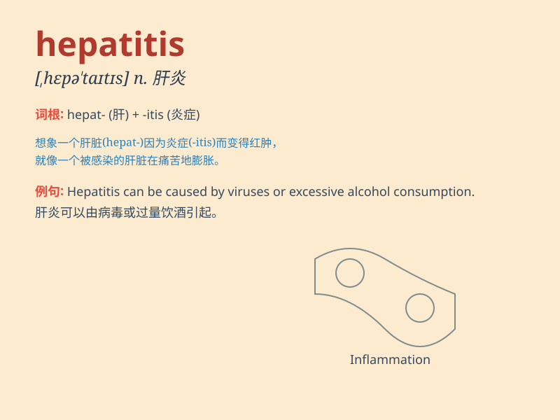

## hepatitis

**英音:** _[,hepə\'taɪtɪs]_ **美音:** _[,hɛpə\'taɪtɪs]_

**译义:** *n.[医]肝炎*

### 短语

+ **viral hepatitis:** _病毒性肝炎_

+ **acute hepatitis:** _急性肝炎_

+ **chronic hepatitis:** _慢性肝炎_

+ **hepatitis A:** _甲型肝炎_

+ **hepatitis B:** _乙型肝炎_

### 例句

#### 例句1

> **Hepatitis is a serious liver disease that requires prompt medical
attention.**

**中文翻译:** 肝炎是一种严重的肝脏疾病，需要及时就医。

**单词释义:** 肝炎

#### 例句2

> **The patient was diagnosed with hepatitis A after a series of
tests.**

**中文翻译:** 经过一系列检查，这位患者被诊断出患有甲型肝炎。

**单词释义:** 肝炎

#### 例句3

> **She is recovering from hepatitis and needs to rest well.**

**中文翻译:** 她正在从肝炎中恢复，需要好好休息。

**单词释义:** 肝炎

### 背诵小故事

> A brave doctor was fighting against a strange disease called
hepatitis. Patients\' livers were affected, but the doctor never gave
up. Finally, a cure was found. Remember, hepatitis is a liver disease!

**一位勇敢的医生正在与一种叫做肝炎的奇怪疾病作斗争。患者的肝脏受到影响，但医生从未放弃。最终，找到了治疗方法。记住，肝炎是一种肝脏疾病！**

### 图义

