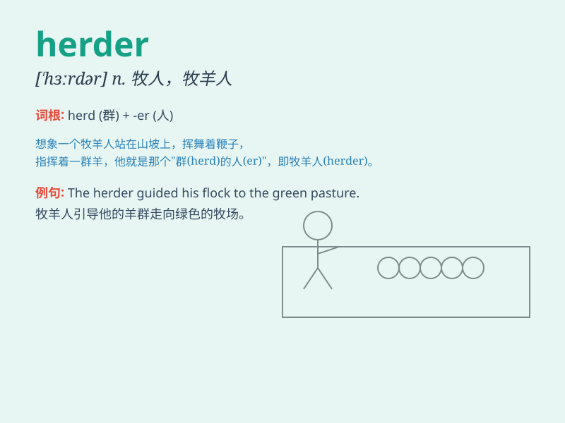

## herder

**英音:** _[ˈhɜːdə]_ **美音:** _[ˈhɛrdər]_

**译义:** *n.牧者,牧人*

### 短语

+ **sheep herder:** _牧羊人_

+ **cattle herder:** _放牛娃；放牛者_

+ **goat herder:** _山羊牧人_

+ **herder dog:** _牧羊犬_

+ **experienced herder:** _经验丰富的牧人_

### 例句

#### 例句1

> **The herder led the sheep to the pasture.**

**中文翻译:** 这位牧民把羊带到了牧场。

**单词释义:** 牧民

#### 例句2

> **The experienced herder knew exactly how to handle the cattle.**

**中文翻译:** 这位经验丰富的牧人确切地知道如何管理牛群。

**单词释义:** 牧人

#### 例句3

> **The herder\'s job is to keep the flock safe from predators.**

**中文翻译:** 这位牧羊人的工作是保护羊群免受掠食者的侵害。

**单词释义:** 牧羊人

### 背诵小故事

> Once upon a time, there was a man named Tom. He was a herder. Every
day, he led his sheep to the green grassland and protected them from
wolves. His job was to make sure the sheep were safe and happy.

**从前，有个叫汤姆的人。他是个牧人。每天，他把他的羊带到绿色的草原，并保护它们免受狼的侵害。他的工作就是确保羊群安全和快乐。**

### 图义

