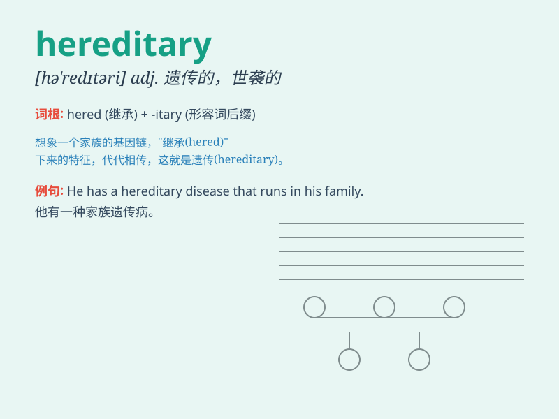

## hereditary

**英音:** _[hɪ\'redɪt(ə)rɪ]_ **美音:**
_[hə\'rɛdə\'tɛri]_

**译义:** *adj.世袭的,遗传的*

### 短语

+ **hereditary disease:** _遗传性疾病_

+ **hereditary factor:** _遗传因素_

+ **hereditary trait:** _遗传特征_

+ **hereditary monarchy:** _世袭君主制_

+ **hereditary property:** _世袭财产_

### 例句

#### 例句1

> **Hereditary factors may play a role in the development of certain
diseases.**

**中文翻译:** 遗传因素可能在某些疾病的发展中起作用。

**单词释义:** 遗传的

#### 例句2

> **The king\'s position was hereditary in that dynasty.**

**中文翻译:** 在那个王朝，国王的地位是世袭的。

**单词释义:** 世袭的

#### 例句3

> **Some hereditary traits are more obvious than others.**

**中文翻译:** 有些遗传特征比其他的更明显。

**单词释义:** 遗传的

### 背诵小故事

> 从前有个家族，他们的特殊能力是 hereditary
的，一代传一代。比如能与动物交流的本领，从祖先开始就一直传给子孙。这就意味着这种能力是通过遗传传递下来的，不可改变。

**从前有个家族，他们的特殊能力是遗传的，一代传一代。比如能与动物交流的本领，从祖先开始就一直传给子孙。这就意味着这种能力是通过遗传传递下来的，不可改变。**

### 图义

