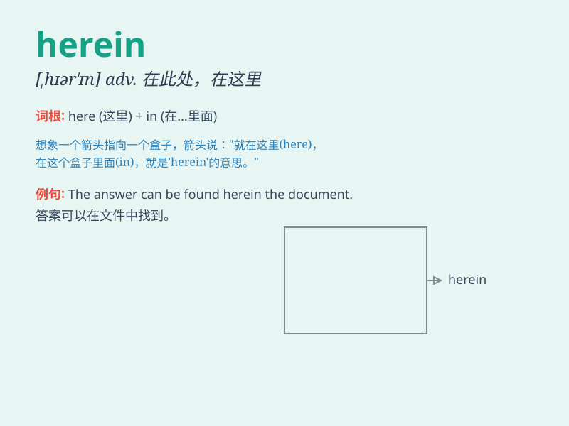

## herein

**英音:** _[hɪər\'ɪn]_ **美音:** _[,hɪr\'ɪn]_

**译义:** *adv.于此,在这里*

### 短语

+ **herein lies:** _这里存在；在于此_

+ **hereinbefore:** _在上文中；以上_

+ **hereinbelow:** _在下文；如下_

+ **herein contained:** _在此包含；此处包含_

+ **herein referred to:** _在此提及；此处所指_

### 例句

#### 例句1

> **The solution to the problem lies herein.**

**中文翻译:** 这个问题的解决办法就在这里。

**单词释义:** 在这里；于此

#### 例句2

> **Herein lies the key to our success.**

**中文翻译:** 我们成功的关键就在这里。

**单词释义:** 在这里

#### 例句3

> **The details of the contract are herein specified.**

**中文翻译:** 合同的细节在此处有明确规定。

**单词释义:** 在此处

### 背诵小故事

> A traveler was lost in a strange town. When he found an old map, he
exclaimed, \'The key to finding my way is herein!\' It means \'in this
place or document\'.

**一位旅行者在一个陌生的城镇迷路了。当他找到一张旧地图时，他惊呼道：'找到路的关键就在这儿！'
这个单词意思是'在这，在此处或此文'。**

### 图义

