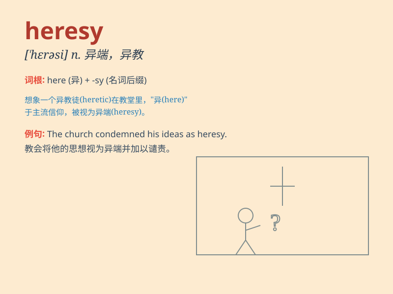

## heresy

**英音:** _[\'herɪsɪ]_ **美音:** _[\'hɛrəsi]_

**译义:** *n.异端,异教*

### 短语

+ **commit heresy:** _犯异端邪说_

+ **heresy trial:** _异端审判_

+ **condemn heresy:** _谴责异端邪说_

+ **persecution for heresy:** _因异端邪说而遭受迫害_

+ **root out heresy:** _根除异端邪说_

### 例句

#### 例句1

> **The church regarded his ideas as heresy.**

**中文翻译:** 教会认为他的想法是异端邪说。

**单词释义:** 异端邪说

#### 例句2

> **Accusing someone of heresy was a serious matter in the Middle
Ages.**

**中文翻译:** 在中世纪，指控某人犯有异端邪说是一件严重的事情。

**单词释义:** 异端邪说

#### 例句3

> **His teachings were considered heresy by the religious
authorities.**

**中文翻译:** 他的教义被宗教当局视为异端邪说。

**单词释义:** 异端邪说

### 背诵小故事

> A long time ago, in a small village, a man proposed a new idea that
contradicted the traditional beliefs. Everyone called his idea
\'heresy\' and they were very angry. But later, it was proved that his
idea was not wrong.

**很久以前，在一个小村庄里，一个人提出了一个与传统信仰相悖的新想法。大家都称他的想法为'异端邪说'，非常生气。但后来，证明他的想法并没有错。**

### 图义

