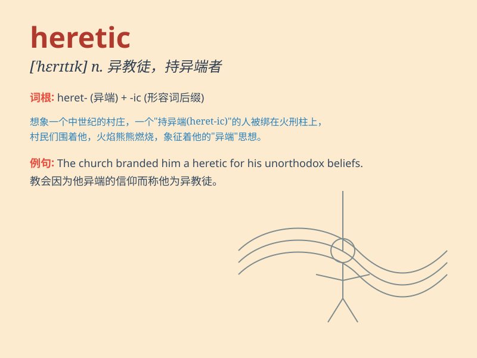

## heretic

**英音:** _[\'herɪtɪk]_ **美音:** _[\'hɛrətɪk]_

**译义:** *n.异教徒,异端者*

### 短语

+ **heretic belief:** _异端信仰_

+ **persecute heretic:** _迫害异端_

+ **heretic ideas:** _异端思想_

+ **condemn as heretic:** _谴责为异端_

+ **heretic sect:** _异端教派_

### 例句

#### 例句1

> **The church regarded him as a heretic and excommunicated him.**

**中文翻译:** 教会认为他是异端分子并将他逐出教会。

**单词释义:** 异端分子

#### 例句2

> **In those days, being labeled a heretic could lead to severe
punishment.**

**中文翻译:** 在那个时代，被贴上异端的标签可能会导致严厉的惩罚。

**单词释义:** 异端

#### 例句3

> **The heretic\'s ideas challenged the traditional beliefs of the
society.**

**中文翻译:** 这个异端的想法挑战了社会的传统信仰。

**单词释义:** 持异端思想的人

### 背诵小故事

> A long time ago, in a small village, there was a man who had
different beliefs from everyone else. People called him a heretic. But
he bravely held on to his ideas, despite the criticism.

**很久以前，在一个小村庄里，有一个人的信仰和其他人都不一样。人们称他为异教徒。但他勇敢地坚持自己的想法，不顾批评。**

### 图义

