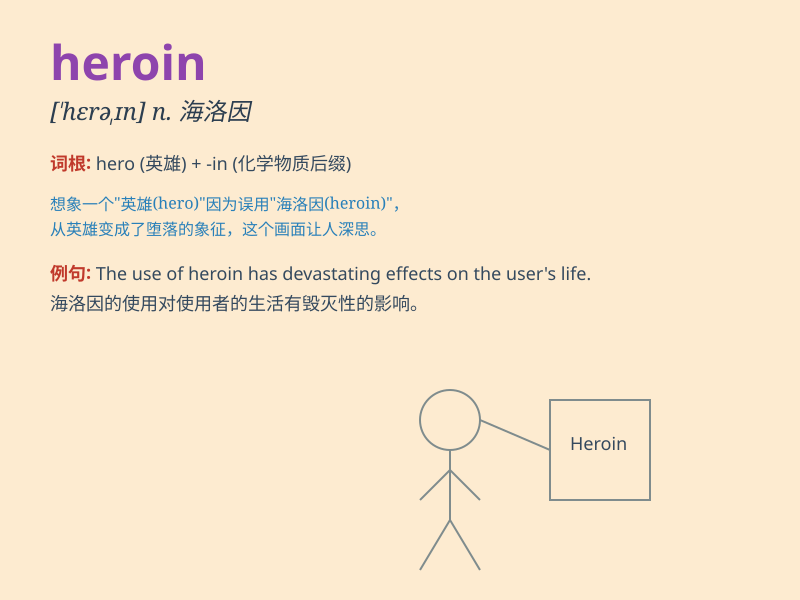

## heroin

**英音:** _[\'herəʊɪn]_ **美音:** _[\'hɛroɪn]_

**译义:** *n.海洛因,吗啡*

### 短语

+ **heroin addict:** _海洛因成瘾者_

+ **heroin trafficking:** _海洛因贩运_

+ **heroin overdose:** _海洛因过量_

+ **heroin use:** _使用海洛因_

+ **heroin withdrawal:** _海洛因戒断_

### 例句

#### 例句1

> **He was addicted to heroin and struggled to break free.**

**中文翻译:** 他沉迷于海洛因并且努力摆脱（毒瘾）。

**单词释义:** 海洛因

#### 例句2

> **The police seized a large quantity of heroin in the raid.**

**中文翻译:** 警方在突袭中查获了大量的海洛因。

**单词释义:** 海洛因

#### 例句3

> **She was arrested for trafficking heroin across the border.**

**中文翻译:** 她因跨境贩卖海洛因而被捕。

**单词释义:** 海洛因

### 背诵小故事

> A young man was lured into a dark alley by a mysterious figure. The
figure offered him something called \'heroin\', claiming it would bring
extreme pleasure. But the young man knew it was a dangerous trap and ran
away.

**一个年轻人被一个神秘人物引诱到一条黑暗的小巷。这个人物给他提供了一种叫做\'海洛因\'的东西，声称它会带来极度的快乐。但年轻人知道这是个危险的陷阱，然后跑开了。**

### 图义

