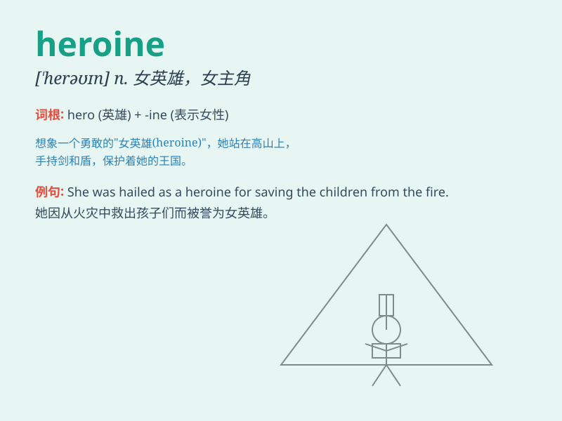

## heroine

**英音:** _[\'herəʊɪn]_ **美音:** _[\'hɛroɪn]_

**译义:** *n.女英雄,女主人公*

### 短语

+ **female heroine:** _女英雄_

+ **heroine of the story:** _故事中的女主人公_

+ **admired heroine:** _令人钦佩的女英雄_

+ **mythical heroine:** _神话中的女英雄_

+ **legendary heroine:** _传奇女英雄_

### 例句

#### 例句1

> **The heroine of the novel is a brave and intelligent woman.**

**中文翻译:** 这部小说的女主人公是一位勇敢且聪明的女性。

**单词释义:** 女主人公；女主角

#### 例句2

> **She became a national heroine for her outstanding achievements in
science.**

**中文翻译:** 她因在科学方面的杰出成就成为了国家女英雄。

**单词释义:** 女英雄

#### 例句3

> **The film tells the story of a young heroine\'s adventure.**

**中文翻译:** 这部电影讲述了一位年轻女英雄的冒险故事。

**单词释义:** 女英雄；女主角

### 背诵小故事

> Once upon a time, in a dangerous city, a brave girl named Lily fought
against villains. She showed no fear and saved many lives. Lily became
the heroine of the city. People loved and respected her.

**从前，在一个危险的城市里，一个叫莉莉的勇敢女孩与坏人作斗争。她毫不畏惧，拯救了许多生命。莉莉成为了这个城市的女英雄。人们爱戴并尊敬她。**

### 图义

