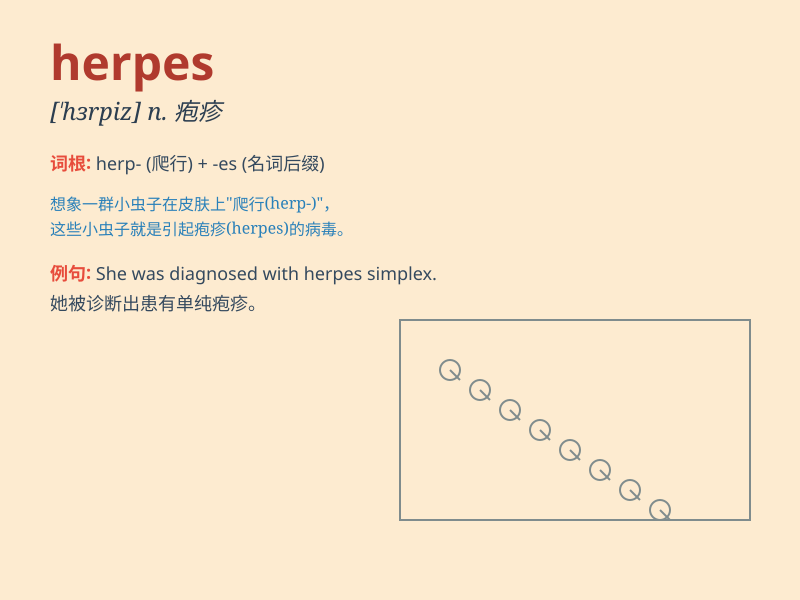

## herpes

**英音:** _[\'hɜːpiːz]_ **美音:** _[\'hɝpiz]_

**译义:** *n.疱疹*

### 短语

+ **herpes simplex:** _单纯疱疹_

+ **herpes zoster:** _带状疱疹_

+ **genital herpes:** _生殖器疱疹_

+ **oral herpes:** _口腔疱疹_

+ **herpes virus:** _疱疹病毒_

### 例句

#### 例句1

> **Herpes can cause painful blisters on the skin.**

**中文翻译:** 疱疹会在皮肤上引起疼痛的水疱。

**单词释义:** 疱疹

#### 例句2

> **The doctor diagnosed her with herpes simplex.**

**中文翻译:** 医生诊断她患有单纯性疱疹。

**单词释义:** 疱疹

#### 例句3

> **He is worried about contracting herpes from his partner.**

**中文翻译:** 他担心从他的伴侣那里感染疱疹。

**单词释义:** 疱疹

### 背诵小故事

> A girl named Lily had a problem. She got herpes on her skin. It made
her very uncomfortable. But with the doctor\'s help and her strong will,
she finally got better. Remember, herpes is not easy to deal with.

**一个叫莉莉的女孩遇到了一个问题。她皮肤上长了疱疹。这让她非常不舒服。但在医生的帮助和她坚强的意志下，她最终好了起来。记住，疱疹可不是好对付的。**

### 图义

